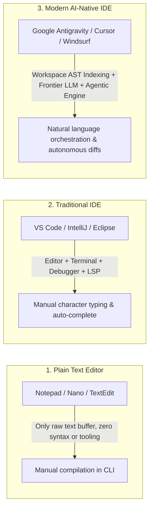
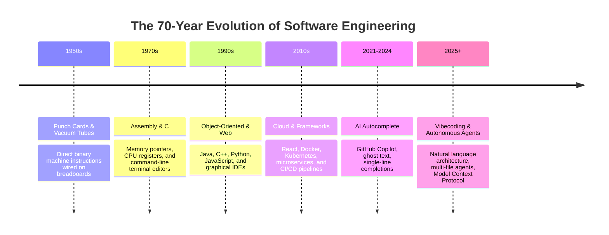
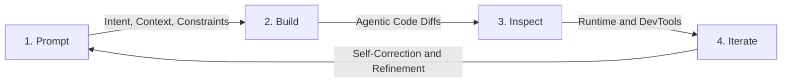
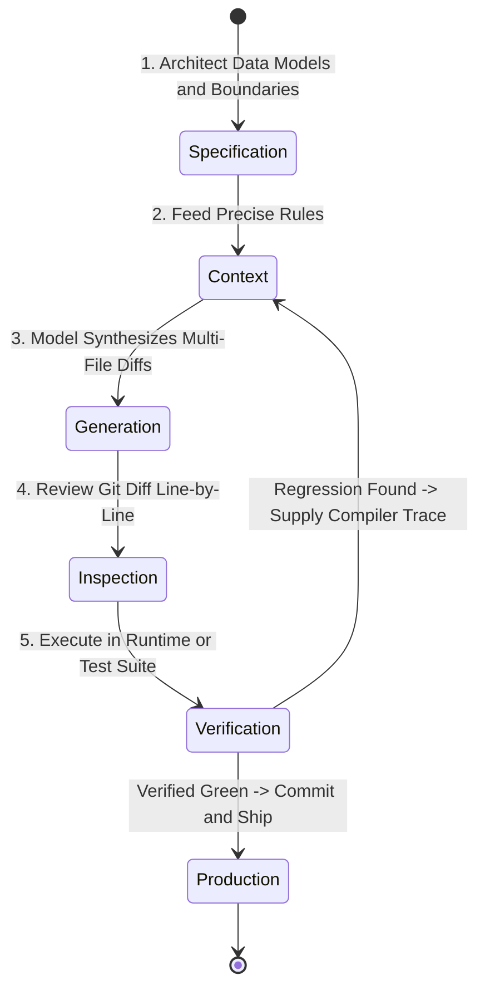

# 1.1 Foundations: From IDEs to Vibecoding

  

    <svg xmlns="http://www.w3.org/2000/svg" width="18" height="18" viewBox="0 0 24 24" fill="none" stroke="currentColor" stroke-width="2" stroke-linecap="round" stroke-linejoin="round"><circle cx="12" cy="12" r="10"></circle><polygon points="10 8 16 12 10 16 10 8"></polygon></svg>
    <strong class="banner-title">Session Focus: The Ground-Up Foundations of Software & AI</strong>
  

  Designed for Computer Science & Engineering students across all years. We start from the absolute ground level: what source code is, what an IDE does, how compilers and runtimes execute logic, and how the industry evolved to AI-first software orchestration.

## Part 1: Ground-Zero Basics — What is an IDE?

Before discussing AI models or vibecoding, every computer science student must understand the core development toolchain.

### Source Code vs. Machine Code
- **Source Code**: Human-readable instructions written in high-level programming languages like Python, JavaScript, C++, Java, or Go. Computers cannot execute source code directly.
- **Machine Code (Binary)**: Raw streams of 0s and 1s representing opcode instructions directly executed by the central processing unit (CPU).
- **The Translation Layer (Compilers, Interpreters & Runtimes)**:
    - **Compiled Languages (C, C++, Rust, Go)**: A compiler (`gcc`, `clang`, `rustc`) translates the entire source file ahead of time into a standalone binary executable file (`.exe` or ELF).
    - **Interpreted / JIT-Compiled Languages (Python, JavaScript, Java)**: Source code is converted into bytecode and executed inside a virtual machine or runtime engine (e.g., Python Interpreter, Java Virtual Machine, or Google Chrome's V8 JavaScript Engine in Node.js).

### The Evolution: Plain Text Editor vs. Traditional IDE vs. AI IDE

An **IDE (Integrated Development Environment)** brings together the entire software engineering workshop under a unified graphical window:

1. **The Code Editor (Text Buffer)**: Provides syntax highlighting (coloring keywords, strings, variables), bracket matching, auto-indentation, and file navigation.
2. **The Integrated Terminal (CLI Shell)**: A command-line prompt (`bash`, `zsh`, `powershell`) embedded directly in the editor to execute programs, install dependencies, and run Git commands.
3. **The Language Server Protocol (LSP)**: A background server engine that parses your code into an Abstract Syntax Tree (AST) in real-time, providing go-to-definition, symbol renaming, and instant squiggly red lines for type errors.
4. **The Debugger & Test Harness**: Lets you set breakpoints, step through code line-by-line, inspect memory variables, and run automated unit tests.
5. **The Agentic Execution Engine (AI IDEs)**: Found in modern IDEs like **Google Antigravity**, **Cursor**, and **Windsurf**. It bridges the LLM directly with your operating system, allowing the model to search the codebase, read compiler outputs, create files, and execute terminal commands autonomously.

---

## Part 2: The Evolution of Programming Interfaces

Computer science history is a continuous climb up levels of abstraction:

Every generation of engineers faced a paradigm shift:
- Assembly programmers initially claimed writing in C was *"lazy and not real programming"*.
- C programmers claimed Python and Java were *"too abstracted and hid the hardware"*.
- Traditional web developers claimed modern frameworks like React and Next.js were *"unnecessary bloat"*.
- Today, traditional typists claim AI-assisted coding is *"cheating"*.

In reality, each leap in abstraction allows engineers to **solve larger, higher-value problems in vastly less time**.

---

## Part 3: What is Vibecoding?

In early 2025, **Andrej Karpathy** (co-founder of OpenAI, former Director of AI at Tesla) coined the term:

> "There is a new kind of coding I call 'vibecoding', where you fully give in to the vibes, embrace the LLM, and forget that the code even exists. [...] I just see stuff, say stuff, run stuff, and copy paste stuff, and it mostly works."

### The Engineering Reality: Vibecoding is System Architecture
In professional computer science, **vibecoding is not mindless copy-pasting**. It is the transition of the software engineer from a **low-level syntax typist** into a **high-level system architect, code reviewer, and context director**.

---

## The 4 Levels of AI-Assisted Development

Where are developers operating today?

| Level | Name | How it Works | Typical Tools | Developer Role |
| :--- | :--- | :--- | :--- | :--- |
| **0** | **Ghost Text** | Single-line autocomplete suggestions inline as you type characters. | Classic Copilot, Tabnine | Typist / Validator |
| **1** | **Sidebar Chat** | Copy-pasting functions into an external chat window to ask questions. | ChatGPT, Claude Web | Context Messenger |
| **2** | **Context-Aware Editor** | In-place multi-file code generation with shadow workspace indexing. | Cursor Composer, Windsurf Cascade | Code Reviewer |
| **3** | **Autonomous Agent** | Self-directed loops that run bash commands, execute test suites, and fix compiler errors. | Google Antigravity, Claude Code, Cline, Gemini CLI | Systems Architect |

---

## The Core Vocabulary Every CSE Student Must Know

Before writing prompts, you must understand how language models process information:

### 1. Token
The foundational unit of computation in an LLM.
- Text is split into numeric tokens using Byte-Pair Encoding (BPE).
- In English code, 1 token is roughly 3 to 4 characters or 0.75 words.
- Syntax characters like `{`, `}`, `(`, `)`, `;` each represent 1 distinct token.

### 2. Context Window
The total memory capacity available to an LLM during a single interaction.
- If a model has a 32,000-token window, it can remember approximately 75 pages of code.
- Google's **Gemini 2.0 Flash** features an industry-leading **1,000,000+ token context window on its free tier**, allowing it to ingest entire repositories, documentation sets, and schemas in a single request!

### 3. KV Caching (Key-Value Caching)
An optimization where prompt tokens that remain constant across requests (like project system instructions and codebase schemas) are cached in GPU memory, drastically accelerating response times and reducing computational overhead.

### 4. Hallucination
When an LLM generates plausible-sounding code that imports non-existent libraries, invokes deprecated functions, or fabricates parameters.

### 5. Grounding
The practice of anchoring the model's output in verified, factual source documents, API documentation, or concrete files provided in the prompt context to eliminate hallucinations.

---

---

## The Vibecoding Workflow: The Antigravity Framework

The modern AI-assisted engineering methodology is codified in the **Antigravity Framework**—an execution paradigm built around an iterative feedback loop:

### The 4 Core Stages of the Loop

#### 1. Prompt (Context Engineering)
- Define the **target deliverable** with surgical clarity.
- Ground the request using `@-mentions` to supply exact data types, schema definitions, and system rules (`SKILL.md` or `.cursorrules`).
- Establish strict **negative constraints** (e.g. *"Do not install new npm packages; use native browser APIs only"*).

#### 2. Build (Autonomous Agent Generation)
- The coding agent (Cursor Composer, Google Antigravity, or Cline) parses the request against the workspace index.
- It calculates unified search-and-replace diffs across affected files.
- In agentic mode, it creates new files, runs scaffolding commands, and builds the initial implementation.

#### 3. Inspect (Verification & Grounding)
- **Never blindly accept code!** Treat every AI output as a draft submitted by a junior intern.
- Review the visual Git diff: check for deleted lines, missing error handling, and hallucinated imports.
- Run the local application (`npm run dev` or local server) and test the feature live in your browser or terminal.

#### 4. Iterate (Diagnostic Steering)
- If the application works as intended, execute a **micro-commit** immediately to save your working state.
- If a runtime error occurs, do not type *"it didn't work"*. Copy the **exact red error trace** from the terminal or browser console and feed it back to the agent for targeted self-correction.

---

## The Vibecoder's Operating Cycle

1. **Architect First**: Define your inputs, outputs, and database models in plain Markdown before touching an AI prompt.
2. **Context Hygiene**: Supply only the files the model needs; do not dump thousands of irrelevant lines into context.
3. **Review the Diff**: Treat AI output like a pull request submitted by an intern. Inspect every modified line.
4. **Compile & Ground**: Run the code immediately in your terminal. If an error appears, feed the exact compiler log back to the model.

