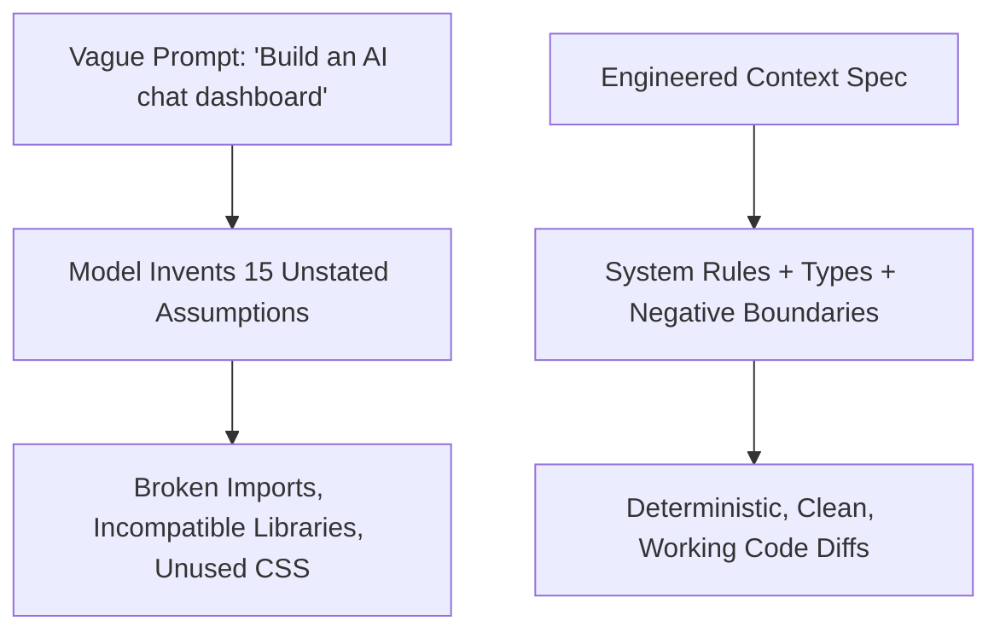

# 1.3 Prompting, Rules & Context Engineering

<div class="session-banner">
  <div class="banner-header">
    <svg xmlns="http://www.w3.org/2000/svg" width="18" height="18" viewBox="0 0 24 24" fill="none" stroke="currentColor" stroke-width="2" stroke-linecap="round" stroke-linejoin="round"><circle cx="12" cy="12" r="10"></circle><polygon points="10 8 16 12 10 16 10 8"></polygon></svg>
    <strong class="banner-title">Session Focus: Context Engineering & System Rules</strong>
  </div>
  Vague instructions force models to make ungrounded guesses. Master the 5-part prompt formula, project-level rules (.cursorrules, AGENTS.md), and negative constraints to ensure deterministic code outputs.
</div>

## The Core Equation of AI Coding

$$\text{Output Precision} = \text{Model Reasoning} \times \mathbf{\text{Context Cleanliness}}$$

If your prompt is vague, the model will invent assumptions. When an AI invents assumptions across multiple files, architectural drift is guaranteed.



---

## The 5-Part Professional Prompt Anatomy

Every production coding prompt must contain these 5 components:

```markdown
1. CONTEXT: What application or module are we building?
2. ARCHITECTURE: Framework, state management, file split.
3. DATA CONTRACT: Exact JSON/TypeScript interfaces for input & output.
4. NEGATIVE CONSTRAINTS: What the model must NOT do.
5. VERIFICATION: Pass criteria (e.g. zero console errors, passes accessibility check).
```

---

## Project System Rules: `.cursorrules` / `AGENTS.md`

Instead of retyping your preferences repeatedly, place this file at your repository root. AI IDEs (Cursor, Windsurf, Cline, Antigravity) automatically inject it into the root context:

```markdown
# Project Rules & Coding Standards

## 1. Persona & Tone
You are a Senior Software Engineer at Google. You write clean, modular, self-documenting code with zero fluff.

## 2. Architectural Conventions
- Architecture: Vanilla HTML5, modern CSS3 variables, and ES6 JavaScript modules.
- Styling: Google Material 3 design tokens. High contrast, accessible colors, and full dark/light mode support.
- Typography: Use Google Fonts ('Outfit' or 'Roboto') instead of default browser fonts.
- Icons: Use clean inline SVG icons; do not install heavy external icon packages.

## 3. Strict Negative Constraints
- DO NOT output placeholder code such as "/* TODO */" or "// add rest of functions".
- DO NOT install heavy npm dependencies when native browser APIs exist (use fetch instead of axios).
- DO NOT invent external API endpoints without user confirmation.

## 4. Error Handling
- Validate all network inputs and external payloads defensively.
- Render user-friendly error banners in the UI whenever an asynchronous call fails.
```

---

## Prompt Comparison: Rookie vs. Professional

=== "Level 1: Rookie Prompt"
    ```text
    make an ai image generator dashboard
    ```
    *Result: Single 1,000-line messy file, fake placeholder links, broken CSS on mobile.*

=== "Level 2: Professional Vibecoder Prompt"
    ```text
    Context: Building an AI dashboard client using native HTML5, modern CSS variables, and ES6 JS.
    
    API Integration:
    - Target: Google Gemini 2.0 Flash API (v1beta)
    - Endpoint: https://generativelanguage.googleapis.com/v1beta/models/gemini-2.0-flash:generateContent
    
    UI Requirements:
    1. Clean Google Material 3 layout with sidebar navigation, main workspace, and status bar.
    2. Input area with drag-and-drop file upload for images and prompt textarea.
    3. Live markdown renderer for returned responses with code copy buttons.
    4. Dark/Light mode toggle persisted in localStorage.
    
    Negative Constraints:
    - Do NOT use React or build tools. Use 3 clean files: index.html, style.css, app.js.
    - Do NOT expose hardcoded API keys; read keys from a secure settings modal stored in localStorage.
    ```
    *Result: Production-ready, modular, responsive, accessible, and runs immediately.*

---

## The Power of Symbol Pinning (`@`)

When using modern editors, avoid typing paths manually. Use symbol anchors:

- `@Files`: Passes the exact, latest contents of a single file (`@app.js`).
- `@Docs`: Passes indexed third-party documentation (`@Gemini`, `@Tailwind`).
- `@Git`: Summarizes recent commits or active uncommitted diffs.
