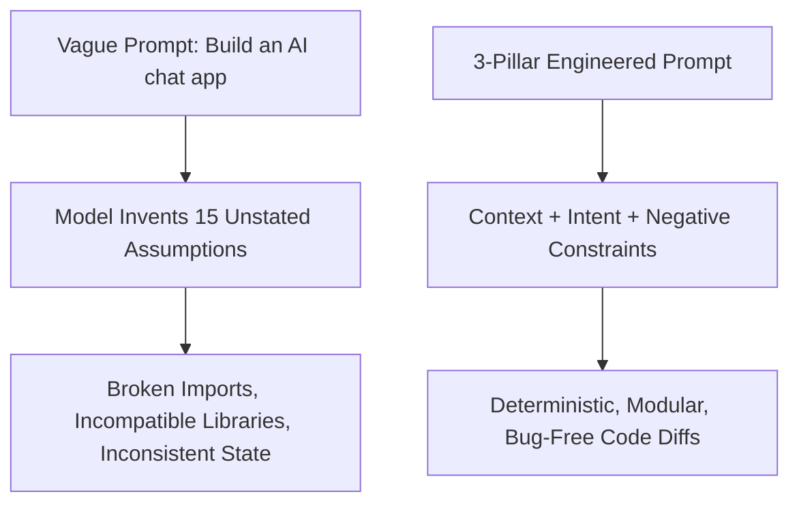
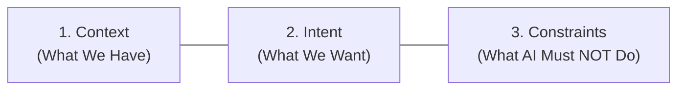
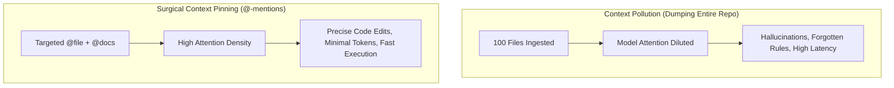
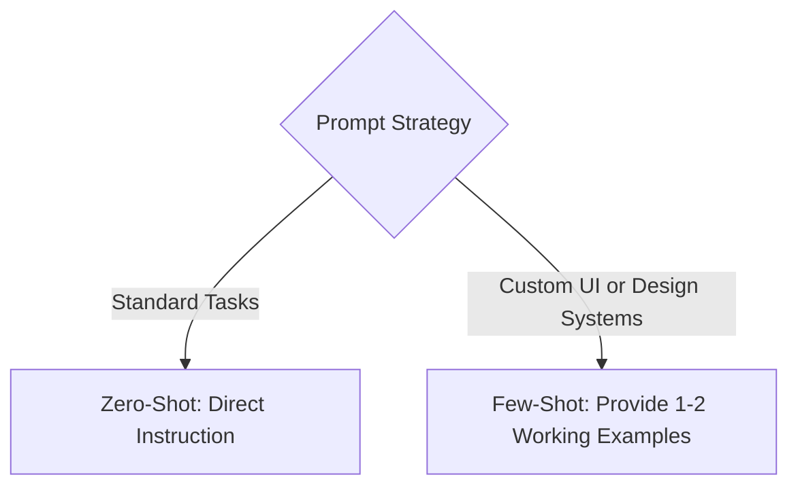

# 1.3 The Anatomy of a Perfect Prompt, Context Management & Rules

<div class="session-banner">
  <div class="banner-header">
    <svg xmlns="http://www.w3.org/2000/svg" width="18" height="18" viewBox="0 0 24 24" fill="none" stroke="currentColor" stroke-width="2" stroke-linecap="round" stroke-linejoin="round"><circle cx="12" cy="12" r="10"></circle><polygon points="10 8 16 12 10 16 10 8"></polygon></svg>
    <strong class="banner-title">Session Focus: Context Engineering & Deterministic Steering</strong>
  </div>
  Vague instructions force AI models to make ungrounded guesses. In this module, we break prompts into their 3 indispensable pillars, master context window memory limits, contrast zero-shot with few-shot prompting, and author reusable agent instructions using SKILL.md and project rules.
</div>

<div class="process-flow" markdown>
<span class="flow-item">Output Precision</span>
<span class="flow-arrow">=</span>
<span class="flow-item">Model Reasoning</span>
<span class="flow-arrow">&times;</span>
<span class="flow-item highlight">Context Cleanliness</span>
</div>

When your prompt is ambiguous, the AI is mathematically forced to sample from a broad probability distribution. Across a multi-file project, unstated assumptions produce architectural drift, broken imports, and mismatched data structures.



---

## 1. The Anatomy of a Perfect Prompt: The 3 Pillars

Every production-grade prompt is anchored by three essential pillars:



### Pillar 1: Context (What We Have)
Establishes the environment, active file dependencies, framework versions, and data contracts.
- *"We have a Next.js 14 App Router project using TypeScript and Tailwind CSS."*
- *"Here is the existing user state interface from `@types/auth.ts`: `{ id: string, role: 'admin' | 'user' }`."*

### Pillar 2: Intent (What We Want)
Declares the exact outcome, user experience, or architectural transformation required.
- *"Create an accessible navbar component with a profile dropdown and logout trigger."*
- *"Implement an asynchronous API client that queries Google Gemini 2.0 Flash using streaming chunks."*

### Pillar 3: Constraints (What the AI Must NOT Do)
Negative boundaries prevent model regressions, lazy placeholders, and unwanted packages.
- *"DO NOT install new npm packages; use native browser `fetch`."*
- *"DO NOT use placeholder comments like `// TODO: implement later`."*
- *"DO NOT alter the existing exported function signatures in `@api.ts`."*

---

## 2. Context Window Management & `@-Mentions`

### Understanding the Memory Limits
Every AI model operates within a finite **context window** (e.g. 128k tokens for Claude 3.5 Sonnet, 1M+ tokens for Gemini 2.0 Flash). However, even when models have massive token limits, dumping your entire codebase into context causes **attention dilution** (the *"lost in the middle"* phenomenon).



### Pinning Exact Context with `@-Mentions`
In AI-native environments (Cursor, Windsurf, Antigravity), use symbol anchors rather than pasting raw files:

| `@-Mention` | What it Does | Example Usage |
| :--- | :--- | :--- |
| `@Files` | Pulls the exact, up-to-date content of a specific file into context. | `@app.js: Refactor this function to handle HTTP 429 rate limits defensively.` |
| `@Folders` | Scans directory structures and index signatures. | `@components: Add an Avatar icon matching the styling of existing cards.` |
| `@Docs` | Feeds indexed third-party documentation directly to the model. | `@Supabase: Show me the syntax for creating an authenticated client with RLS.` |
| `@Git` | Passes recent commit messages or active uncommitted git diffs. | `@Git: Review uncommitted changes for potential security leaks.` |

---

## 3. Zero-Shot vs. Few-Shot Prompting

When steering models, you can choose between direct instruction (**Zero-Shot**) and pattern demonstration (**Few-Shot**):



### Zero-Shot Prompting
You describe the task without providing prior code examples. Best for standard, well-documented conventions (e.g., standard CSS flexbox layouts, standard Node.js file reading).

```text
Prompt:
Write a TypeScript function that takes an array of user objects and returns 
only the active users sorted alphabetically by their lastName.
```

### Few-Shot Prompting
You provide one or more concrete input/output examples of the exact pattern, coding style, or UI token schema you want the model to mimic. Essential for custom design systems, internal APIs, or strict formatting:

```text
Prompt:
We use a custom API response envelope throughout this project.

Example 1:
Input: Success with user data
Output:
{
  "status": "success",
  "data": { "id": "u_123", "name": "Alex" },
  "error": null,
  "timestamp": 1718000000
}

Example 2:
Input: Failure with missing field
Output:
{
  "status": "error",
  "data": null,
  "error": { "code": "VALIDATION_FAILED", "message": "Email is required" },
  "timestamp": 1718000000
}

Task:
Now write the response envelope for an unauthorized access attempt to a protected admin route.
```

---

## 4. Agent Instructions: `SKILL.md`, `.cursorrules` & `AGENTS.md`

Instead of retyping your instructions in every single prompt, persistent instruction files allow you to steer agents globally across your entire repository.

### Writing a Project `SKILL.md`
A `SKILL.md` or `.cursorrules` file sits in your project root and automatically anchors the agent's baseline behavior:

```markdown
# Project Rules & Agent Instructions

## 1. Identity & Architecture
- Framework: Next.js 14 App Router with TypeScript & Tailwind CSS.
- Database: Supabase PostgreSQL with Row Level Security (RLS) enabled on all tables.
- Model: Google Gemini 2.0 Flash via REST API.

## 2. Code Quality & Standards
- Use functional React components with explicit TypeScript props.
- Keep components modular and single-purpose; do not exceed 150 lines per file.
- Use native browser fetch or the official Supabase JS client.

## 3. Negative Constraints (Strict Rules)
- NEVER hardcode API keys or secrets in source files.
- NEVER delete existing comments or documentation unless explicitly instructed.
- NEVER invent external dependencies not listed in package.json.

## 4. Error Handling
- Always wrap asynchronous calls in try/catch/finally blocks.
- Surface error messages clearly in the user interface rather than silently failing.
```

---

## 5. Side-by-Side Prompt Comparison

=== "Rookie Prompt (High Failure Rate)"
    ```text
    make a database for my app with users and posts
    ```
    *Flaws*: No schema, no data types, no constraints, no security rules. The AI will invent random column names, omit foreign keys, and fail to enable Row Level Security.

=== "Professional Prompt (Deterministic & Secure)"
    ```text
    Context:
    Building a blogging MVP with Supabase and Next.js 14.

    Intent:
    Write a clean PostgreSQL migration script that creates two tables:
    1. 'profiles': id (UUID, primary key references auth.users.id), username (text, unique), avatar_url (text), created_at (timestamptz).
    2. 'posts': id (UUID, default gen_random_uuid()), author_id (UUID, references profiles.id on delete cascade), title (text), content (text), is_published (boolean, default false), created_at (timestamptz).

    Constraints & Security:
    - Enable Row Level Security (RLS) on both tables immediately.
    - Add RLS policy: Anyone can read published posts.
    - Add RLS policy: Users can only insert, update, or delete their own posts (matching auth.uid() = author_id).
    - Output only executable SQL.
    ```
    *Result*: Production-grade, secure, relational schema with zero security vulnerabilities.
