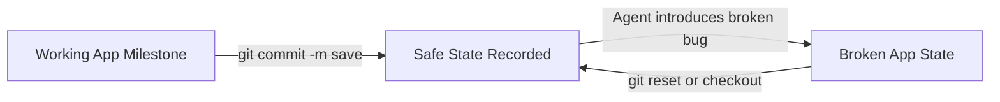
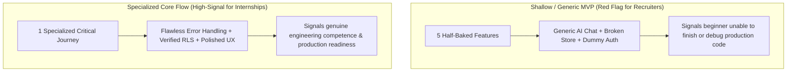
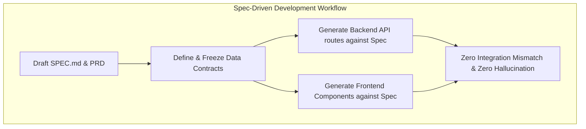
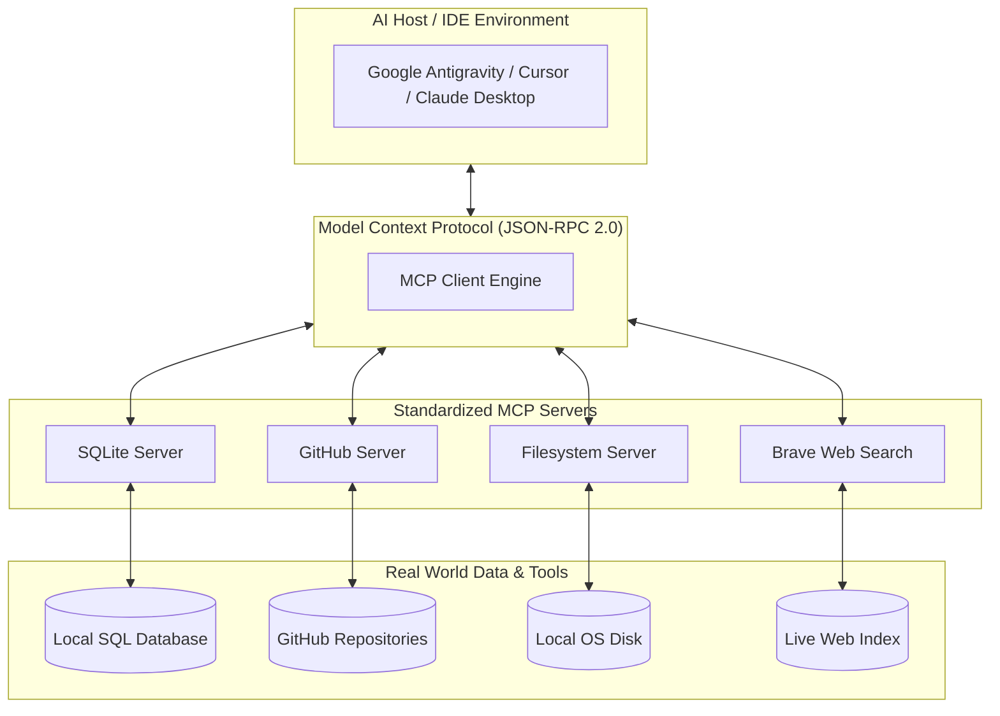

# 1.4 Architecture: APIs, Specs & Model Context Protocol (MCP)

<div class="session-banner">
  <div class="banner-header">
    <svg xmlns="http://www.w3.org/2000/svg" width="18" height="18" viewBox="0 0 24 24" fill="none" stroke="currentColor" stroke-width="2" stroke-linecap="round" stroke-linejoin="round"><circle cx="12" cy="12" r="10"></circle><polygon points="10 8 16 12 10 16 10 8"></polygon></svg>
    <strong class="banner-title">Session Focus: Architectural Specs & Tool Protocols</strong>
  </div>
  Designed for CSE students: We demystify what an API and JSON payload actually are, explore why Spec-Driven Development (SDD) stops AI hallucinations, and learn how Model Context Protocol (MCP) acts as a universal USB-C cable connecting AI to databases and tools.
</div>

## Part 1: What is an API & Client-Server Architecture?

In computer science, software systems rarely run in isolation. They communicate across networks using **APIs (Application Programming Interfaces)**.

```mermaid
graph LR
    Client["Client (Browser / Mobile / IDE)"] -->|1. HTTP Request (Method, Headers, JSON Body)| Server["Server (Cloud GPU / Database / Gemini API)"]
    Server -->|2. Executes business logic & queries models| Server
    Server -->|3. HTTP Response (Status Code, JSON Data)| Client
```

### The 4 Core Elements of an HTTP Web Request

1. **Endpoint (URL)**: The unique internet address where the server listens for requests (e.g. `https://generativelanguage.googleapis.com/v1beta/models/gemini-2.0-flash:generateContent`).
2. **HTTP Methods (Verbs)**:
    - `GET`: Retrieve data from a server without modifying state (e.g. fetching user profiles).
    - `POST`: Send new data to be processed or created (e.g. sending a user prompt to an LLM).
    - `PUT` / `PATCH`: Update an existing resource.
    - `DELETE`: Remove a resource from the server.
3. **HTTP Headers (Metadata)**:
    - `Content-Type: application/json`: Informs the server that the payload is formatted as JSON.
    - `Authorization: Bearer <API_KEY>`: Provides secret authentication credentials.
4. **HTTP Status Codes**:
    - `200 OK` / `201 Created`: The request succeeded.
    - `400 Bad Request`: Malformed JSON or missing required fields.
    - `401 Unauthorized` / `403 Forbidden`: Invalid or missing API key.
    - `404 Not Found`: The endpoint URL does not exist.
    - `429 Too Many Requests`: Rate limit exceeded (you sent too many requests per minute).
    - `500 Internal Server Error`: The remote server crashed while processing the request.

---

### What is JSON (JavaScript Object Notation)?

JSON is the universal language-agnostic text format used to exchange structured data across computers:

```json
{
  "project": "OmniVibe AI Studio",
  "version": 1.0,
  "isProduction": false,
  "features": ["code_generation", "vision_analysis", "mcp_tooling"],
  "modelConfig": {
    "modelName": "gemini-2.0-flash",
    "temperature": 0.2,
    "maxTokens": 2048
  }
}
```

- **JSON Data Types**: Strings (`"text"`), Numbers (`42`, `3.14`), Booleans (`true`/`false`), Arrays (`[1, 2, 3]`), Objects (`{ "key": "value" }`), and `null`.
- **Parsing in JavaScript**:
    - `JSON.stringify(object)`: Converts a JavaScript object into a JSON string to transmit over the network.
    - `JSON.parse(string)`: Converts a received JSON string into a native JavaScript object.

---

---

## Part 2: Version Control Essentials (Git & GitHub)

When building with autonomous coding agents, **Git is not just for backup—it is your primary safety net**.



### The 4 Fundamental Git Commands Every Builder Must Know
1. **`git init` / `git clone`**: Initializes a new repository or downloads an existing codebase from GitHub.
2. **`git status` & `git diff`**: Inspects exactly what files changed. Always run `git diff` before accepting an AI change to ensure the model didn't delete critical lines or silently change logic.
3. **`git add .` & `git commit -m "..."`**: Records a permanent snapshot. Commit every time a feature or bugfix works.
4. **`git push origin main`**: Synchronizes your local commits to GitHub, triggering your automated deployment pipeline on Vercel.

---

## Part 3: PRD & MVP Basics: Framing High-Competence Scopes

A major hurdle for beginners is **scope creep**—attempting to build a multi-sided marketplace, a social network, and an AI agent all in one weekend.

### Narrow, Specialized Core Flows vs. "Jack of All Trades"
When framing your Minimum Viable Product (MVP), commit to a **single, narrow, specialized core flow**:



A flawlessly executed, highly focused tool signals genuine competence for future internship applications, keeping your portfolio from looking like a *"jack of all trades but master of none"*.

### The 3 Core Pillars of a Real MVP PRD
1. **Target User**: Who specifically uses this in the first 60 seconds? (e.g., *"Undergraduate CSE students debugging C compiler errors"*).
2. **Core Problem**: What single friction point does it resolve? (e.g., *"Translating cryptic GCC segmentation fault traces into annotated plain English explanations with memory diagrams"*).
3. **"Done" Criteria (Acceptance Bounds)**: When is the prototype complete?
   - [x] Accepts a pasted GCC error message.
   - [x] Generates an annotated explanation using Gemini 2.0 Flash.
   - [x] Persists history to Supabase database.
   - [x] Runs on a live, public HTTPS Vercel URL with zero console errors.

---

## Part 4: Idea Selection & Feasibility Scoring

Before jumping into code, review prospective app ideas through a **Technical Feasibility Filter**:

| Criterion | High Feasibility (Green Light) | Low Feasibility (Red Flag / Scope Trap) |
| :--- | :--- | :--- |
| **Data Requirements** | Uses free public APIs or simple user-generated inputs | Requires proprietary datasets, web scraping, or paid subscriptions |
| **State Complexity** | Single-user CRUD or clean relational database (Supabase) | Complex multi-tenant real-time websockets or blockchain ledgers |
| **Model Interaction** | 1-2 structured prompt calls with clear JSON output | Multi-step unconstrained autonomous agent loops with unknown token costs |
| **Time to First Demo** | Under 45 minutes to get a basic working prototype | Days of boilerplate before seeing the first screen |

Debate feasibility with your peers, discard features that don't serve the core journey, and lock the project scope before Day 2 begins.

---

## Part 5: Spec-Driven Development (SDD)

When developers prompt an AI to create an application without a specification, the AI makes ungrounded guesses: it invents the database schema in step 1, invents the API format in step 2, and contradicts itself by step 3.

**Spec-Driven Development (SDD)** solves this by establishing a frozen Markdown specification (`SPEC.md`) containing data models and interfaces before writing a single line of application code.



### Universal `SPEC.md` Template for AI Projects

Save this file in your project root before prompting:

```markdown
# Specification: [Project Name]

## 1. Goal & Objective
One-sentence summary of what problem this tool solves.

## 2. Technical Stack
- Frontend: HTML5, CSS Variables, ES6 Modules (or Next.js 14)
- AI Model: Google Gemini 2.0 Flash (REST API)
- Backend & DB: Supabase (PostgreSQL with RLS)
- Hosting: Vercel (Production CI/CD)

## 3. Data Schema & Contracts
```typescript
interface ChatMessage {
  id: string;              // UUID
  role: 'user' | 'model';  // Sender
  text: string;            // Content
  timestamp: number;       // Unix epoch ms
}

interface UserPreferences {
  apiKey: string;
  theme: 'light' | 'dark';
}
```

## 4. Acceptance Criteria
- Core user journey functions end-to-end without uncaught errors.
- Supabase data persists across sessions.
- Deployed on live Vercel HTTPS domain.
```


---

## Part 6: Model Context Protocol (MCP) Masterclass

### The Problem MCP Solves: The $N \times M$ Integration Trap

Prior to 2025, if an AI model needed to query a database, read GitHub issues, or search the web, developers had to write custom, proprietary glue code for every model provider.

If there are $N$ AI models (Claude, Gemini, GPT-4o, DeepSeek) and $M$ tools (Postgres, GitHub, Slack, SQLite, Filesystem), developers had to build and maintain **$N \times M$ custom integrations**.

**Model Context Protocol (MCP)**, created by Anthropic and adopted as an open industry standard across Google Antigravity, Cursor, and Claude, turns this into an **$N + M$ open ecosystem**, functioning as the **universal USB-C of AI models**.



---

### The 3 Core Primitives of MCP

MCP exposes three fundamental capabilities to AI models:

1. **Tools**: Executable functions that the AI can choose to invoke with structured arguments (e.g. `query_database({ sql: "SELECT * FROM users" })`). Tools can modify state.
2. **Resources**: Passive, read-only data streams (like open files, documentation, or log streams) that the model can inspect to gain contextual understanding without executing logic.
3. **Prompts**: Pre-engineered prompt templates and workflows exposed by the server (e.g., an automated `debug-error` prompt supplied by a database server).

---

### How MCP Communicates Under the Hood (JSON-RPC 2.0)

MCP runs over two transport channels:
- **`stdio`**: Standard input/output pipes when the MCP server runs as a local child process on your computer.
- **`SSE` (Server-Sent Events)**: HTTP streaming when connecting to a remote MCP server over a local network or cloud.

Every message adheres to the strict **JSON-RPC 2.0 standard**:

```json
// AI Host -> MCP Server (Tool Call Request)
{
  "jsonrpc": "2.0",
  "id": "req-101",
  "method": "tools/call",
  "params": {
    "name": "read_user_record",
    "arguments": { "userId": 42 }
  }
}

// MCP Server -> AI Host (Execution Result)
{
  "jsonrpc": "2.0",
  "id": "req-101",
  "result": {
    "content": [
      {
        "type": "text",
        "text": "User #42: Alice Smith, Email: alice@example.com, Role: Admin"
      }
    ]
  }
}
```

---

### Building a Custom MCP Server in 25 Lines (Node.js / TypeScript)

Students can build their own custom MCP tools using the official `@modelcontextprotocol/sdk`:

```javascript
import { Server } from "@modelcontextprotocol/sdk/server/index.js";
import { StdioServerTransport } from "@modelcontextprotocol/sdk/server/stdio.js";
import { CallToolRequestSchema, ListToolsRequestSchema } from "@modelcontextprotocol/sdk/types.js";

// 1. Initialize the MCP Server
const server = new Server({ name: "student-math-server", version: "1.0.0" }, { capabilities: { tools: {} } });

// 2. Register the list of available tools
server.setRequestHandler(ListToolsRequestSchema, async () => ({
  tools: [{
    name: "calculate_gpa",
    description: "Calculates grade point average given credit hours and letter grades",
    inputSchema: {
      type: "object",
      properties: {
        grades: { type: "array", items: { type: "number" }, description: "Array of grade points (e.g. [4.0, 3.7, 3.3])" }
      },
      required: ["grades"]
    }
  }]
}));

// 3. Handle tool execution
server.setRequestHandler(CallToolRequestSchema, async (request) => {
  if (request.params.name === "calculate_gpa") {
    const grades = request.params.arguments.grades;
    const avg = grades.reduce((sum, g) => sum + g, 0) / grades.length;
    return { content: [{ type: "text", text: `Calculated GPA: ${avg.toFixed(2)}` }] };
  }
  throw new Error("Tool not found");
});

// 4. Connect to standard input/output transport
const transport = new StdioServerTransport();
await server.connect(transport);
```

---

### Configuring MCP in Your AI IDE (`mcp_config.json`)

To enable MCP servers in **Google Antigravity**, **Cursor**, or **Claude Desktop**, add this configuration to your user settings:

```json
{
  "mcpServers": {
    "sqlite": {
      "command": "npx",
      "args": ["-y", "@modelcontextprotocol/server-sqlite", "--db-path", "./data/app.db"]
    },
    "github": {
      "command": "npx",
      "args": ["-y", "@modelcontextprotocol/server-github"],
      "env": {
        "GITHUB_PERSONAL_ACCESS_TOKEN": "ghp_yourTokenHere"
      }
    },
    "filesystem": {
      "command": "npx",
      "args": ["-y", "@modelcontextprotocol/server-filesystem", "C:\\Users\\Priyanshu\\Desktop\\Projects"]
    }
  }
}
```

---

### Essential Pre-Built MCP Servers for Students

| MCP Server | What it Connects | Command to Run |
| :--- | :--- | :--- |
| **SQLite** | Local SQL databases | `npx -y @modelcontextprotocol/server-sqlite --db-path ./app.db` |
| **Filesystem** | Secure folder reading/writing outside workspace | `npx -y @modelcontextprotocol/server-filesystem [path]` |
| **GitHub** | Pull requests, issues, repo search | `npx -y @modelcontextprotocol/server-github` |
| **Brave Search** | Real-time live web search | `npx -y @modelcontextprotocol/server-brave-search` |
| **PostgreSQL** | Production PostgreSQL databases | `npx -y @modelcontextprotocol/server-postgres [connection_string]` |

By mastering **Spec-Driven Architecture** and **Model Context Protocol**, CSE students transition from casual chat users to professional AI systems architects.
