# 1.5 Hands-On: Rapid Prototyping (20 Min)

<div class="session-banner">
  <div class="banner-header">
    <svg xmlns="http://www.w3.org/2000/svg" width="18" height="18" viewBox="0 0 24 24" fill="none" stroke="currentColor" stroke-width="2" stroke-linecap="round" stroke-linejoin="round"><circle cx="12" cy="12" r="10"></circle><polygon points="10 8 16 12 10 16 10 8"></polygon></svg>
    <strong class="banner-title">Hands-On Lab: Rapid Prototyping (20 Minutes)</strong>
  </div>
  Apply the Day 1 principles in a 20-minute guided build. Follow along to generate, preview, and test PromptVault Lite using a clean 3-file architecture and browser localStorage.
</div>

## Lab Objective: Build "PromptVault Lite"

We will build **PromptVault Lite** — a local, privacy-first developer prompt organizer that runs in the browser. It stores, tags, filters, and formats prompt templates with variable replacement (e.g. `{context}`, `{task}`) and 1-click clipboard copying.

```mermaid
graph LR
    A[Empty Directory] -->|Phase 1: Rules & Spec| B[Initialize .cursorrules]
    B -->|Phase 2: Master Prompt| C[3-File Clean Scaffold]
    C -->|Phase 3: Live Preview| D[Browser Testing]
    D -->|Phase 4: Iterative Refinement| E[Dark Mode + Tag Filter]
    E -->|Phase 5: Commit| F[Verified Working Prototype]
```



---

## Step 1: Project Setup (2 Minutes)

In your terminal:

```bash
mkdir promptvault
cd promptvault
git init
```

Create `.cursorrules` (or `AGENTS.md`) at root:

```markdown
# PromptVault Guidelines
- Tech: Vanilla HTML5, modern CSS variables, ES6 Vanilla JS.
- Design: Google Material 3 aesthetic (Blue #4285F4, Red #EA4335, Yellow #FBBC05, Green #34A853).
- Data: Persist all prompts in browser localStorage.
- Accessibility: High contrast, keyboard accessible.
```

---

## Step 2: The Master Scaffold Prompt (5 Minutes)

Open Cursor Composer (<kbd>Ctrl</kbd>+<kbd>I</kbd> / <kbd>Cmd</kbd>+<kbd>I</kbd>) or your AI editor, and enter:

<div class="prompt-box">
  <div class="prompt-label">Copy-Paste Prompt</div>
  Build a complete web application called "PromptVault" using 3 files: index.html, style.css, and app.js.<br><br>
  Features:<br>
  1. Header with GDG BITS Pilani Dubai Campus branding and Light/Dark mode toggle (persisted in localStorage).<br>
  2. Form to create a new prompt: Title, Category tag (Refactor, Architecture, Debug, Docs), Template text with variables in {variable} syntax.<br>
  3. Preload 3 high-quality default prompt templates into localStorage if empty.<br>
  4. Search bar that filters prompts in real time by title, category, or content.<br>
  5. Each prompt card displays Title, Category pill badge, template preview, and two action buttons:<br>
     - "Test & Fill": Opens an inline accordion where users input variable values to preview the compiled prompt.<br>
     - "Copy": Copies compiled text to clipboard with visual toast feedback.<br>
  6. Styling must adhere to Google Material 3 tokens with smooth transitions.<br><br>
  Write all three files completely without placeholders.
</div>

---

## Step 3: Run & Inspect Locally (3 Minutes)

1. Review the generated multi-file diff in your IDE and accept changes.
2. Open `index.html` via Live Server or run:
   ```bash
   python -m http.server 3000
   ```
3. Open `http://localhost:3000` in your browser.

---

## Step 4: Iterative Refinements (5 Minutes)

=== "Refinement 1: Category Filter Buttons"
    ```text
    In @index.html and @app.js, add a horizontal category filter bar right below the search input:
    - Include buttons: "All", "Refactor", "Architecture", "Debug", "Documentation".
    - Clicking a pill filters the displayed cards immediately.
    - Active pill receives Google Blue highlight.
    ```

=== "Refinement 2: JSON Backup Export/Import"
    ```text
    In @app.js and @index.html, add an "Export JSON" button and an "Import JSON" file picker in the header.
    Allow users to backup their prompts as a prompts.json file, or load external prompt collections.
    ```

---

## Step 5: Verify & Save Checkpoint (5 Minutes)

```bash
git add .
git commit -m "feat: complete PromptVault warm-up prototype with local storage"
```

This completes your Day 1 hands-on warm-up. You now have a working prototype and verified tooling!
