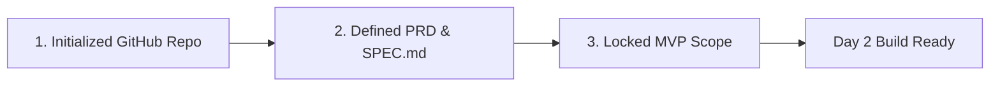

# 1.6 Day 1 Checkpoint: Locked PRD & Repo Setup

<div class="session-banner">
  <div class="banner-header">
    <svg xmlns="http://www.w3.org/2000/svg" width="18" height="18" viewBox="0 0 24 24" fill="none" stroke="currentColor" stroke-width="2" stroke-linecap="round" stroke-linejoin="round"><circle cx="12" cy="12" r="10"></circle><polygon points="10 8 16 12 10 16 10 8"></polygon></svg>
    <strong class="banner-title">Milestone Review: Day 1 Key Deliverables</strong>
  </div>
  Congratulations on completing Day 1! Before closing today's session, verify that your 3 core deliverables are locked in. Tomorrow morning we transition from conceptual planning into the 2-hour live product build.
</div>

## Day 1 Deliverables Audit

Every participant and team should have the following three artifacts finalized:



### 1. Initialized GitHub Repository
- [x] Repository created on GitHub (e.g. `github.com/username/my-vibecoding-app`).
- [x] Cloned locally on your laptop.
- [x] `.gitignore` present with `.env*` excluded.
- [x] Initial commit pushed to `main`.

### 2. Defined PRD & `SPEC.md`
- [x] Problem statement and target user documented in `PRD.md` or `SPEC.md`.
- [x] Core data schema (TypeScript interfaces or JSON models) defined.
- [x] Acceptance criteria listed with verifiable pass/fail rules.

### 3. Locked MVP Scope
- [x] Focused strictly on a single core user journey (no feature bloat).
- [x] Technical feasibility verified (zero reliance on unverified paid APIs).
- [x] Team consensus achieved on primary UI screens.

---

## 30-Second API & Environment Sanity Test

Run this quick command in your terminal to verify that your API credentials and runtime are responding:

```bash
curl "https://generativelanguage.googleapis.com/v1beta/models/gemini-2.0-flash:generateContent?key=YOUR_API_KEY" \
  -H "Content-Type: application/json" \
  -d '{"contents":[{"parts":[{"text":"Respond with: Ready for Day 2 Live Build!"}]}]}'
```

If you receive a JSON payload with `"text": "Ready for Day 2 Live Build!"`, your workstation is fully primed.

---

## What We Build in Day 2: The Build Sprint

Tomorrow in **Day 2**, we transform this specification into a functional, localized application:
- **Project Initialization**: Prompting the coding agent to scaffold the project structure.
- **Component-Driven Generation**: Building small, modular components rather than bloated monoliths.
- **Core Flow Construction & Logic**: Wiring up state management and the Gemini 2.0 Flash API.
- **Debugging & Micro-Commits**: Reading stack traces, taming hallucinations, and committing save states.
- **Feature Freeze**: Polishing the UI and committing the final local version before backend integration.
