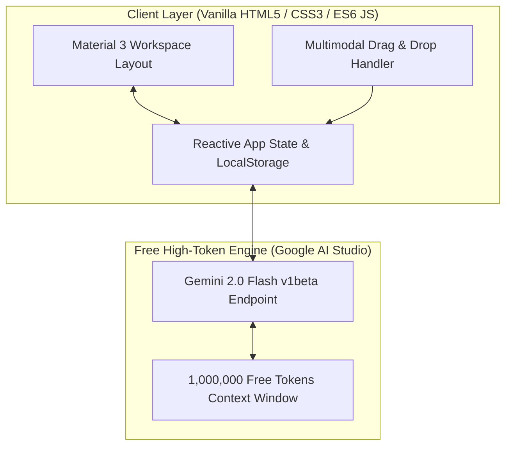

# 2.1 The Free Tech Stack & Project Blueprint

  

    <svg xmlns="http://www.w3.org/2000/svg" width="18" height="18" viewBox="0 0 24 24" fill="none" stroke="currentColor" stroke-width="2" stroke-linecap="round" stroke-linejoin="round"><circle cx="12" cy="12" r="10"></circle><polygon points="10 8 16 12 10 16 10 8"></polygon></svg>
    <strong class="banner-title">Live Build Blueprint: 2-Hour Product Construction</strong>
  

  Welcome to Day 2! Over the next 120 minutes, we construct OmniVibe AI Studio from a completely empty directory to a functioning, multimodal AI developer workspace powered by Google Gemini 2.0 Flash.

## The Project: "OmniVibe AI Studio"

To demonstrate the full power of modern vibecoding, we will build **OmniVibe AI Studio**: an interactive developer AI workspace featuring:
1. **Real-time AI Chat with Streaming**: Fast response generation using Gemini 2.0 Flash.
2. **Multimodal Vision Analysis**: Drag-and-drop screenshots or diagrams for instant code generation or bug analysis.
3. **Google Material 3 Interface**: High-contrast theme toggle (Light/Dark), responsive layout, and mobile-friendly grid.
4. **Local History & Markdown Export**: Client-side storage with 1-click export to `.md`.

---

## Why This Free Tech Stack?

To ensure every student can replicate this project without a paid subscription:

| Technology | Role | Why It Was Chosen | Cost |
| :--- | :--- | :--- | :--- |
| **Google Gemini 2.0 Flash** | AI Engine | 1M tokens context, multimodal vision, sub-second latency | Free (Google AI Studio) |
| **Vanilla HTML5 + Modern CSS3** | Frontend | Zero npm install delays, runs in any browser instantly | Free |
| **ES6 JavaScript Modules** | Logic | Native modular imports (`import`/`export`) without Webpack | Free |
| **Browser LocalStorage** | Database | Zero backend database provisioning required for MVP | Free |
| **Live Server / Python HTTP** | Dev Server | Instant hot-reloading | Free |

---

## The 120-Minute Build Roadmap

| Time | Phase | Focus Area | Interactive Milestone |
| :--- | :--- | :--- | :--- |
| **00:00 - 00:30** | [Phase 1: Spec & Scaffolding](02-phase-1-spec-and-scaffolding.md) | Requirements, `SPEC.md`, 3-file layout | Interactive feature specification |
| **00:30 - 01:15** | [Phase 2: Live Gemini Integration](03-phase-2-live-gemini-integration.md) | Streaming API, client state, error recovery | Real-time AI response validation |
| **01:15 - 01:45** | [Phase 3: Multimodal Vision & Polish](04-phase-3-multimodal-and-polish.md) | Image drag & drop, dark mode, toast alerts | Live screenshot code generation |
| **01:45 - 02:00** | [Phase 4: Wrap-up & Challenge](06-phase-4-wrapup-and-overnight-challenge.md) | Backup code checkpoint, overnight challenge | Project starter distribution |

---

## Engineering Principles for High-Velocity Prototyping

1. **Architect Before Generating**: Outline data contracts and component responsibilities before prompting the model.
2. **Transparent Compiler Grounding**: When runtime errors occur, pass the exact browser or terminal stack trace into the context rather than subjective explanations.
3. **Modular Phase Checkpoints**: Validate each milestone independently (Layout -> API -> Vision -> Storage) to prevent regression cascades.
