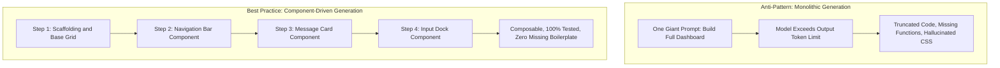

# 2.2 Phase 1: Live Spec & Scaffolding (00:00 - 00:30)

<div class="session-banner">
  <div class="banner-header">
    <svg xmlns="http://www.w3.org/2000/svg" width="18" height="18" viewBox="0 0 24 24" fill="none" stroke="currentColor" stroke-width="2" stroke-linecap="round" stroke-linejoin="round"><circle cx="12" cy="12" r="10"></circle><polygon points="10 8 16 12 10 16 10 8"></polygon></svg>
    <strong class="banner-title">Phase 1 Milestone (00:00 - 00:30): Architecture & Workspace Scaffolding</strong>
  </div>
  In this opening phase, we define project boundaries in SPEC.md, establish Google Material 3 design tokens, and scaffold a responsive 3-file workspace layout ready for live model integration.
</div>

## Step 1: Initialize Workspace & Rules (3 Minutes)

In your terminal:

```bash
mkdir omnivibe-studio
cd omnivibe-studio
git init
```

Create `.cursorrules` (or `AGENTS.md`) at root:

```markdown
# OmniVibe Studio Coding Rules
- Stack: Vanilla HTML5, modern CSS with CSS variables, ES6 JavaScript modules.
- UI: Google Material 3 tokens (Blue #4285F4, Red #EA4335, Yellow #FBBC05, Green #34A853).
- Responsive: Fluid layout that adapts across Mobile (<600px), Tablet (<900px), and Desktop.
- Data: Save history in localStorage. Use clean, defensive error handling for network calls.
```

---

## Step 2: Draft `SPEC.md` Live on Projector (5 Minutes)

Create `SPEC.md` to define the architecture before prompting:

```markdown
# OmniVibe AI Studio Specification

## 1. Goal
A browser-based AI workspace that interfaces with the free Google Gemini 2.0 Flash API to provide instant code analysis, chat, and image understanding.

## 2. Layout & Components
- Header: GDG BITS Pilani Dubai Campus branding, status indicator, Settings modal button, and Dark/Light toggle.
- Left Sidebar: History of past chat sessions (stored in localStorage) with a "New Session" button.
- Main Workspace:
  - Scrollable message stream (User message card vs AI response card).
  - Code blocks with syntax formatting and a 1-click copy button.
- Bottom Input Dock:
  - Drag-and-drop image upload thumbnail preview.
  - Multi-line autosizing textarea.
  - Send button with keyboard shortcut (Enter to send, Shift+Enter for newline).

## 3. Storage Schema
```typescript
interface Session {
  id: string;
  title: string;
  createdAt: number;
  messages: Array<{
    role: 'user' | 'model';
    text: string;
    image?: string;
  }>;
}
```
```

---

## Step 3: The Phase 1 Scaffolding Prompt (10 Minutes)

Open your AI editor's Composer or Agent interface (`Ctrl+I` / `Cmd+I`) and enter:

<div class="prompt-box">
  <div class="prompt-label">Copy-Paste Prompt</div>
  Context: Read @SPEC.md and @.cursorrules.<br><br>
  Task: Scaffold the complete, working frontend for OmniVibe AI Studio across 3 files: index.html, style.css, and app.js.<br><br>
  Requirements:<br>
  1. index.html: Semantic layout including sidebar, chat container, settings modal (for API key), and bottom input dock with image file input and textarea.<br>
  2. style.css: Modern Google Material 3 styling with CSS custom properties for both light and dark themes. Include smooth card transitions and full mobile responsiveness.<br>
  3. app.js: Modular ES6 code handling sidebar toggle, theme switching, message rendering, and mock AI responses for immediate visual testing.<br><br>
  Write all three files completely without placeholders.
</div>

---

## Step 4: Live Verification on Browser (12 Minutes)

1. Review the generated multi-file diff and click **Accept All**.
2. Launch a local web server:
   ```bash
   python -m http.server 3000
   ```
3. Open `http://localhost:3000`.
4. Demonstrate to the audience:
   - Sidebar opens and collapses smoothly.
   - Light/Dark mode toggles and persists across page reloads.
   - Typing a message creates a user card and simulates an AI response card.

---

## Engineering Principle: Component-Driven Generation vs. Monoliths

A foundational mistake beginners make is asking the AI to build entire systems in one prompt:
- ❌ *"Build the whole dashboard with charts, chat, database, authentication, and payment processing."*

This invariably leads to incomplete code, syntax errors, and missing functions marked with `// TODO: implement later`.



### Why Component-Driven Generation Wins:
1. **Fits in Output Token Limits**: AI models typically have an output limit of 4,096 or 8,192 tokens per response. Asking for a full application in one shot guarantees truncated files.
2. **Easy Visual Verification**: You can test each component in the browser the moment it is generated.
3. **Isolated Bug Fixing**: If a component has an issue, you prompt the AI to fix only that isolated component rather than rewriting your entire application.

