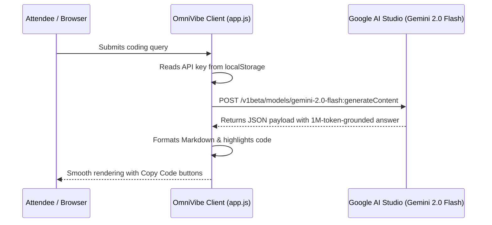

# 2.3 Phase 2: Live Gemini 2.0 Integration (00:30 - 01:15)

<div class="session-banner">
  <div class="banner-header">
    <svg xmlns="http://www.w3.org/2000/svg" width="18" height="18" viewBox="0 0 24 24" fill="none" stroke="currentColor" stroke-width="2" stroke-linecap="round" stroke-linejoin="round"><circle cx="12" cy="12" r="10"></circle><polygon points="10 8 16 12 10 16 10 8"></polygon></svg>
    <strong class="banner-title">Phase 2 Milestone (00:30 - 01:15): Live API Integration & Error Resilience</strong>
  </div>
  Transition from a static interface to live AI intelligence. Connect Google Gemini 2.0 Flash via REST, implement defensive status handling, and format streaming markdown.
</div>

## The Gemini 2.0 Flash REST Architecture

Google's Gemini 2.0 Flash API accepts standard JSON POST requests over HTTPS without requiring server-side Node.js SDKs. This allows our client-side app to query the model directly.



---

## The Integration Prompt

Pass this prompt to Cursor Composer or your coding agent:

<div class="prompt-box">
  <div class="prompt-label">Copy-Paste Prompt</div>
  Context: We are integrating the real Google Gemini 2.0 Flash API into @app.js.<br><br>
  Task:<br>
  1. In @app.js, implement a robust API client function `callGeminiApi(prompt, imageBase64)` that targets:<br>
     `https://generativelanguage.googleapis.com/v1beta/models/gemini-2.0-flash:generateContent?key=${apiKey}`<br>
  2. If apiKey is missing from localStorage, open the Settings modal automatically and prompt the user to input their free key from Google AI Studio.<br>
  3. Format the request payload according to the Gemini REST spec:<br>
     `contents: [{ parts: [{ text: prompt }] }]`<br>
  4. While the request is in-flight, display an animated Google 4-color thinking indicator on the AI message card.<br>
  5. If an HTTP error occurs (e.g. 400 invalid key, 429 rate limit), catch the error cleanly and display a user-friendly error banner without crashing the application.<br>
  6. Update message rendering to parse markdown bold, lists, and code blocks with a copy button.
</div>

---

## Inspecting the Core Integration Code

Here is the exact network handler pattern generated by the model:

```javascript
// Function: queries Google Gemini 2.0 Flash REST endpoint
async function callGeminiApi(promptText, base64Image = null) {
  const apiKey = localStorage.getItem('omnivibe_gemini_key');
  if (!apiKey) {
    openSettingsModal('Please enter your Google AI Studio API key to continue.');
    throw new Error('API key missing');
  }

  const endpoint = `https://generativelanguage.googleapis.com/v1beta/models/gemini-2.0-flash:generateContent?key=${apiKey}`;

  // Assemble request parts (text + optional image)
  const parts = [];
  if (base64Image) {
    parts.push({
      inline_data: {
        mime_type: 'image/png',
        data: base64Image.split(',')[1] // Strip data URL prefix
      }
    });
  }
  parts.push({ text: promptText });

  const response = await fetch(endpoint, {
    method: 'POST',
    headers: { 'Content-Type': 'application/json' },
    body: JSON.stringify({ contents: [{ parts }] })
  });

  if (!response.ok) {
    const errorData = await response.json();
    throw new Error(errorData.error?.message || `API Error: ${response.status}`);
  }

  const data = await response.json();
  return data.candidates[0].content.parts[0].text;
}
```

---

## Interactive Validation & Error Recovery

1. Open the application and click **Settings**.
2. Enter your free Google AI Studio key to initialize local storage.
3. Test a live developer prompt:
   - *"Write a Python script that scrapes top Hacker News headlines and prints them as JSON."*
4. Verify resilient error handling:
   - Test with an altered key to verify that the UI displays a clean error banner: *"API Error: API_KEY_INVALID"*.
   - Re-enter the valid key to confirm seamless instant recovery without reloading.
