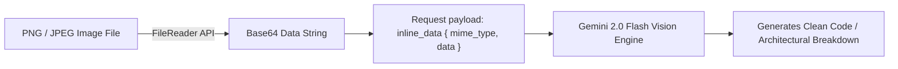

# 2.4 Phase 3: Multimodal Vision & UI Polish (01:15 - 01:45)

<div class="session-banner">
  <div class="banner-header">
    <svg xmlns="http://www.w3.org/2000/svg" width="18" height="18" viewBox="0 0 24 24" fill="none" stroke="currentColor" stroke-width="2" stroke-linecap="round" stroke-linejoin="round"><circle cx="12" cy="12" r="10"></circle><polygon points="10 8 16 12 10 16 10 8"></polygon></svg>
    <strong class="banner-title">Phase 3 Milestone (01:15 - 01:45): Multimodal Vision & Production Polish</strong>
  </div>
  Expand the developer studio with computer vision. Process drag-and-drop screenshots through Gemini 2.0 Flash's multimodal engine and add Markdown session export.
</div>

## Unlocking Multimodal Vision (Zero Extra Cost)

Because Gemini 2.0 Flash natively accepts images and video within its 1M token window, adding computer vision to our app requires no external vision APIs or separate subscriptions.



---

## The Vision & Polish Prompt

Pass this refinement prompt to your AI editor:

<div class="prompt-box">
  <div class="prompt-label">Copy-Paste Prompt</div>
  Context: Enhancing @index.html, @style.css, and @app.js.<br><br>
  Task 1: Multimodal Vision Drag & Drop<br>
  - Add a drag-and-drop file target over the input dock. When an image (PNG, JPG, WebP) is dropped or pasted via clipboard (<kbd>Ctrl</kbd>+<kbd>V</kbd>), render a thumbnail preview with a remove button.<br>
  - Convert the image to base64 and attach it to the `callGeminiApi` payload.<br><br>
  Task 2: Export to Markdown<br>
  - In the header, add an "Export Chat" button that packages the current conversation into a downloadable `omnivibe-session.md` file using a dynamic Blob URL.<br><br>
  Task 3: Visual Polish & Toast Notifications<br>
  - Add a floating toast banner at the bottom right indicating: "Code copied to clipboard!" or "Chat exported successfully!"<br>
  - Ensure contrast passes WCAG AA guidelines in both light and dark themes.
</div>

---

## Inspecting the Image to Base64 Handler

Here is how the browser handles image drag-and-drop and clipboard pasting:

```javascript
// Function: converts an image File object to a Base64 string for Gemini API
function fileToBase64(file) {
  return new Promise((resolve, reject) => {
    const reader = new FileReader();
    reader.onload = () => resolve(reader.result);
    reader.onerror = error => reject(error);
    reader.readAsDataURL(file);
  });
}

// Event: supports pasting images directly from the clipboard
window.addEventListener('paste', async event => {
  const items = (event.clipboardData || event.originalEvent.clipboardData).items;
  for (const item of items) {
    if (item.kind === 'file' && item.type.startsWith('image/')) {
      const file = item.getAsFile();
      const base64 = await fileToBase64(file);
      attachImagePreview(base64);
    }
  }
});
```

---

## Interactive Multimodal Walkthrough

1. Capture a screenshot of any UI button, form, or card component.
2. Paste it directly into OmniVibe Studio with <kbd>Ctrl</kbd>+<kbd>V</kbd> (or drag-and-drop the file).
3. Enter prompt: *"Recreate this UI component using clean HTML and modern CSS variables."*
4. Inspect the generated markup and CSS rendered within seconds.
5. Click **Copy Code** and observe the toast confirmation.
6. Click **Export Chat** to save the conversation as a `.md` markdown file.
