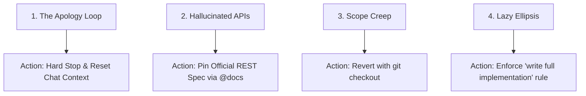

# 2.5 Live Error Handling & Apology Loops

<div class="session-banner">
  <div class="banner-header">
    <svg xmlns="http://www.w3.org/2000/svg" width="18" height="18" viewBox="0 0 24 24" fill="none" stroke="currentColor" stroke-width="2" stroke-linecap="round" stroke-linejoin="round"><circle cx="12" cy="12" r="10"></circle><polygon points="10 8 16 12 10 16 10 8"></polygon></svg>
    <strong class="banner-title">Session Focus: Diagnostic Steering & Error Resolution</strong>
  </div>
  Learn how to resolve hallucination loops, isolate runtime exceptions, and provide high-leverage diagnostic steering to frontier models.
</div>

## The 4 Common Failure Modes



---

## 3 Core Rules for Diagnostic Steering

### Rule 1: Reset Context After Consecutive Regressions
If the model produces an incorrect patch twice consecutively:
1. Close the current chat session to flush accumulated context errors.
2. Open a fresh conversation window.
3. Pass only the isolated function and the exact runtime trace.

### Rule 2: Pass Raw Stack Traces Directly
Do not summarize: *"The button stopped working."*  
Copy the red stack trace from DevTools:
```text
Uncaught (in promise) TypeError: Cannot read properties of undefined (reading 'candidates')
at callGeminiApi (app.js:32:41)
at handleSend (app.js:68:19)
```

### Rule 3: Use the Rubber-Duck Reverse Prompt
Force the model to diagnose before modifying code:
```text
Before proposing any code edits:
1. Explain why 'candidates' was undefined in the payload above.
2. Check if the API returned an HTTP error status or quota warning.
3. Provide a defensive check: if (!data.candidates) throw new Error(data.error?.message).
```
