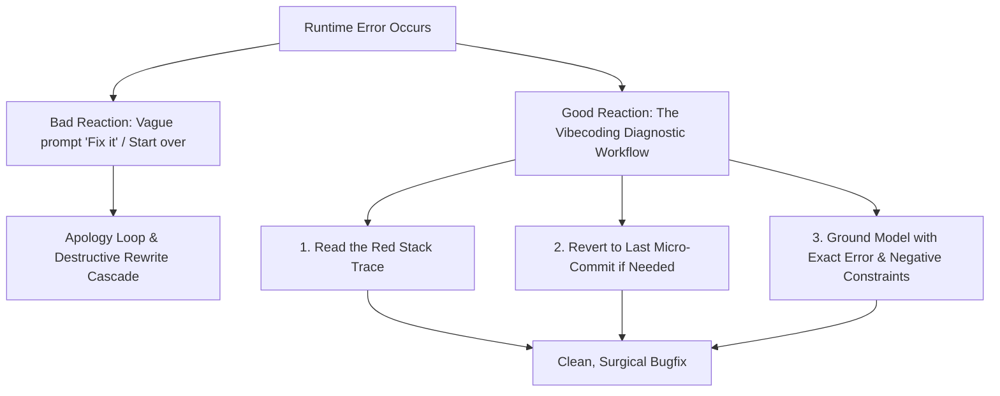
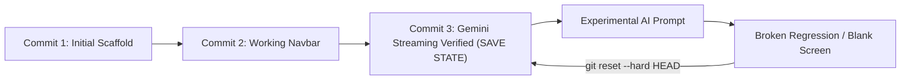
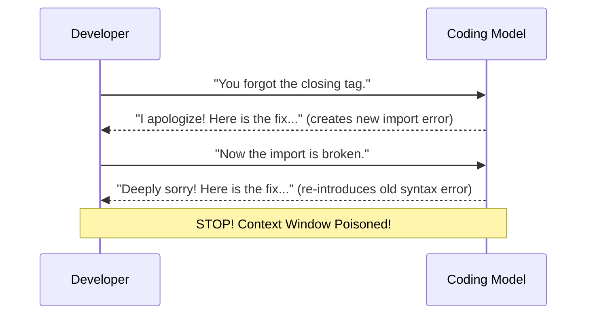

# 2.5 Taming Hallucinations, Micro-Commits & Reading the Red

<div class="session-banner">
  <div class="banner-header">
    <svg xmlns="http://www.w3.org/2000/svg" width="18" height="18" viewBox="0 0 24 24" fill="none" stroke="currentColor" stroke-width="2" stroke-linecap="round" stroke-linejoin="round"><circle cx="12" cy="12" r="10"></circle><polygon points="10 8 16 12 10 16 10 8"></polygon></svg>
    <strong class="banner-title">Diagnostic Steering: Handling the Inevitable AI Regressions</strong>
  </div>
  When coding with AI, errors are not a sign of failure—they are normal milestones in the feedback loop. In this module, you will learn to spot hallucinations, use micro-commits as save states, read red stack traces in browser consoles and terminals, and guide the AI to self-correct without destructive rewrites.
</div>

## The Reality of AI Mistakes

Frontier models like Gemini 2.0 Flash and Claude 3.5 Sonnet are exceptionally capable, but they are probabilistic engines. Left unconstrained, models can invent non-existent libraries, delete working code during refactors, or get stuck in apology loops.



---

## 1. Taming AI Hallucinations

An **AI Hallucination** occurs when a model outputs syntactically valid code that references non-existent constructs.

### The 3 Hallucination Warning Signs
1. **The Ghost Package**: The AI prompts you to run `npm install react-gemini-stream-v2` or `npm install supabase-chat-ui`. These packages do not exist!
   - *Defense*: Check [npmjs.com](https://www.npmjs.com/) before running `npm install`. Enforce: *"Use native standard libraries only."*
2. **The Deprecated API Call**: The AI attempts to invoke legacy endpoints (e.g., using old OpenAI completion endpoints or obsolete SDK methods).
   - *Defense*: Pass the official documentation URL or pin the spec using `@Docs`.
3. **The Invented Endpoint**: The model assumes a backend endpoint exists (`/api/v1/auth/gemini/stream`) when you haven't created it.
   - *Defense*: Ground the model with your real directory structure using `@Files` or `@SPEC.md`.

---

## 2. The Micro-Commit Strategy: Your Infinite Save States

When beginners code with AI, they often prompt for 45 minutes without saving. Then, the AI introduces a bug that breaks everything, and in an attempt to fix it, the AI destroys earlier working progress.



### The Rule of the Micro-Commit
> **Commit code EVERY TIME the application works, no matter how small the milestone.**

```bash
# Workflow: Small win -> Instant commit
git add .
git commit -m "feat: working light/dark mode toggle"

# Next small win -> Instant commit
git add .
git commit -m "feat: successful Gemini API call returning text"
```

### The 10-Second Rollback (Your Nuclear Option)
If an AI agent produces a massive, broken diff that tangles multiple files:
```bash
# Discard all uncommitted changes in 1 second:
git reset --hard HEAD
```
You are instantly back to your last verified working save state. You lose zero hours of progress and can formulate a cleaner, more surgical prompt.

---

## 3. Reading the Red: Stack Traces as First-Class Context

Never summarize an error to an AI with vague language like:
- :material-close: *"The button isn't working."*
- :material-close: *"It gave an error."*
- :material-close: *"Fix the app, it's blank."*

These vague prompts cause the AI to guess wildly, often rewriting unrelated functions and introducing new regressions.

### How to Read the Red Stack Trace
1. **Open Browser DevTools**: Press `F12` or `Ctrl+Shift+I` (Windows) / `Cmd+Option+I` (macOS), then click the **Console** tab.
2. **Identify the File and Line Number**: Look at the right-hand column of the red error log.

```text
Uncaught (in promise) TypeError: Cannot read properties of undefined (reading 'parts')
    at callGeminiApi (app.js:42:35)
    at HTMLButtonElement.handleSend (app.js:78:12)
```

**Anatomy of this error**:
- **What happened**: JavaScript tried to access `.parts` on an object that was `undefined`.
- **Where it happened**: In file `app.js` at line 42, called from line 78.
- **Root cause**: The API response did not have the structure the code expected (e.g. rate limit error payload instead of a standard candidate response).

### The Copy-Paste Diagnostic Prompt Pattern
Feed the raw error directly to the AI with diagnostic instructions:

<div class="prompt-box">
  <div class="prompt-label">Diagnostic Steering Prompt</div>
  Context: In @app.js, we encountered this runtime exception in the browser console:<br><br>
  <code>
  Uncaught (in promise) TypeError: Cannot read properties of undefined (reading 'parts')<br>
  &nbsp;&nbsp;&nbsp;&nbsp;at callGeminiApi (app.js:42:35)
  </code><br><br>
  Instructions:<br>
  1. DO NOT rewrite the whole file.<br>
  2. Explain why 'candidates[0].content.parts' was undefined (check for HTTP 400/429 error structures).<br>
  3. Add a defensive check that inspects response status and throws a clean, readable error message if candidates are missing.<br>
  4. Provide only the updated callGeminiApi function.
</div>

---

## 4. Breaking the Apology Loop

When an AI responds with *"I apologize for the oversight, let me fix that..."* and then produces code that introduces the exact same bug, you are in an **Apology Loop**.



### The 3-Step Apology Loop Breaker
1. **Hard Stop**: Do not continue arguing in the existing chat thread. The context window is poisoned with bad attempts.
2. **Open a Fresh Conversation**: Close the current chat tab. A clean session restores the model's unpolluted reasoning capability.
3. **Supply the Working Save State + Error**: Reference the last working git state and pass only the single file with the red stack trace.
