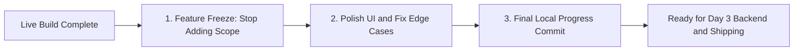

# 2.6 Phase 4: Backup Code & Overnight Challenge (105-120m)

<div class="session-banner">
  <div class="banner-header">
    <svg xmlns="http://www.w3.org/2000/svg" width="18" height="18" viewBox="0 0 24 24" fill="none" stroke="currentColor" stroke-width="2" stroke-linecap="round" stroke-linejoin="round"><circle cx="12" cy="12" r="10"></circle><polygon points="10 8 16 12 10 16 10 8"></polygon></svg>
    <strong class="banner-title">Phase 4 Milestone: Verified Code Checkpoint & Overnight Challenge</strong>
  </div>
  Congratulations on completing the 2-hour build! Below is the complete verified source code implementation for OmniVibe AI Studio, followed by instructions for the overnight builder challenge.
</div>

## Complete Verified Source Code Reference

For study, testing, and extension, here is the complete 3-file codebase:

=== "index.html"
    ```html
    <!DOCTYPE html>
    <html lang="en">
    <head>
      <meta charset="UTF-8">
      <meta name="viewport" content="width=device-width, initial-scale=1.0">
      <title>OmniVibe AI Studio | GDG BITS Pilani Dubai Campus</title>
      <link rel="stylesheet" href="style.css">
      <link rel="preconnect" href="https://fonts.googleapis.com">
      <link rel="preconnect" href="https://fonts.gstatic.com" crossorigin>
      <link href="https://fonts.googleapis.com/css2?family=Outfit:wght@400;500;600;700&family=JetBrains+Mono:wght@400;500&display=swap" rel="stylesheet">
    </head>
    <body>
      <div class="app-layout">
        <!-- Sidebar -->
        <aside class="sidebar" id="sidebar">
          <div class="sidebar-header">
            <h3>Sessions</h3>
            <button class="icon-btn" id="newSessionBtn" title="New Session">+</button>
          </div>
          <div class="session-list" id="sessionList"></div>
        </aside>

        <!-- Main Workspace -->
        <main class="main-content">
          <!-- Top Bar -->
          <header class="top-bar">
            <div class="brand">
              <span class="gdg-dot blue"></span>
              <span class="gdg-dot red"></span>
              <span class="gdg-dot yellow"></span>
              <span class="gdg-dot green"></span>
              <strong>OmniVibe Studio</strong>
            </div>
            <div class="header-actions">
              <button class="btn btn-outline" id="exportBtn">Export .md</button>
              <button class="btn btn-outline" id="settingsBtn">Settings</button>
              <button class="icon-btn" id="themeToggleBtn" title="Toggle Theme">🌓</button>
            </div>
          </header>

          <!-- Chat Stream -->
          <section class="chat-container" id="chatContainer"></section>

          <!-- Input Dock -->
          <footer class="input-dock">
            <div class="preview-area" id="previewArea" style="display: none;">
              
              <button class="remove-btn" id="removeImgBtn">&times;</button>
            </div>
            <div class="input-row">
              <label class="icon-btn attach-btn" title="Attach Image">
                <input type="file" id="fileInput" accept="image/*" style="display: none;">
                📎
              </label>
              <textarea id="promptInput" rows="1" placeholder="Type instructions or paste screenshot (Ctrl+V)..."></textarea>
              <button class="btn btn-primary" id="sendBtn">Send</button>
            </div>
          </footer>
        </main>
      </div>

      <!-- Settings Modal -->
      <dialog class="modal" id="settingsModal">
        <form method="dialog" class="modal-card">
          <h3>Google AI Studio Settings</h3>
          <p>Enter your free Gemini 2.0 API key from aistudio.google.com:</p>
          <input type="password" id="apiKeyInput" placeholder="AIzaSy..." required>
          <div class="modal-actions">
            <button class="btn btn-outline" value="cancel">Close</button>
            <button class="btn btn-primary" id="saveKeyBtn">Save Key</button>
          </div>
        </form>
      </dialog>

      <div class="toast" id="toast"></div>
      <script src="app.js"></script>
    </body>
    </html>
    ```

=== "style.css"
    ```css
    /* Google Material 3 Design Tokens */
    :root {
      --bg: #ffffff;
      --surface: #f8f9fa;
      --border: #e8eaed;
      --text: #202124;
      --text-muted: #5f6368;
      --blue: #4285F4;
      --blue-hover: #1a73e8;
      --red: #EA4335;
      --yellow: #FBBC05;
      --green: #34A853;
      --font: 'Outfit', sans-serif;
      --mono: 'JetBrains Mono', monospace;
    }

    [data-theme="dark"] {
      --bg: #1e1f20;
      --surface: #282a2c;
      --border: #3c4043;
      --text: #e8eaed;
      --text-muted: #9aa0a6;
    }

    * { box-sizing: border-box; margin: 0; padding: 0; }
    body { font-family: var(--font); background: var(--bg); color: var(--text); height: 100vh; overflow: hidden; }

    .app-layout { display: flex; height: 100vh; }
    .sidebar { width: 260px; background: var(--surface); border-right: 1px solid var(--border); display: flex; flex-direction: column; }
    .sidebar-header { padding: 1rem; display: flex; justify-content: space-between; align-items: center; border-bottom: 1px solid var(--border); }
    .session-list { flex: 1; overflow-y: auto; padding: 0.5rem; }

    .main-content { flex: 1; display: flex; flex-direction: column; height: 100vh; }
    .top-bar { height: 60px; border-bottom: 1px solid var(--border); display: flex; align-items: center; justify-content: space-between; padding: 0 1.5rem; }
    .brand { display: flex; align-items: center; gap: 6px; }
    .gdg-dot { width: 9px; height: 9px; border-radius: 50%; }
    .gdg-dot.blue { background: var(--blue); }
    .gdg-dot.red { background: var(--red); }
    .gdg-dot.yellow { background: var(--yellow); }
    .gdg-dot.green { background: var(--green); }

    .chat-container { flex: 1; overflow-y: auto; padding: 1.5rem; display: flex; flex-direction: column; gap: 1rem; }
    .msg-card { max-width: 80%; padding: 1rem 1.25rem; border-radius: 12px; font-size: 0.95rem; line-height: 1.6; }
    .msg-user { align-self: flex-end; background: var(--blue); color: #fff; }
    .msg-model { align-self: flex-start; background: var(--surface); border: 1px solid var(--border); }

    .input-dock { padding: 1rem 1.5rem; border-top: 1px solid var(--border); background: var(--bg); }
    .input-row { display: flex; gap: 0.5rem; align-items: flex-end; }
    textarea { flex: 1; border: 1px solid var(--border); border-radius: 8px; padding: 0.75rem; font-family: var(--font); background: var(--surface); color: var(--text); resize: none; }

    .btn { padding: 0.5rem 1rem; border-radius: 8px; font-weight: 500; cursor: pointer; border: none; }
    .btn-primary { background: var(--blue); color: #fff; }
    .btn-outline { background: transparent; border: 1px solid var(--border); color: var(--text); }
    .icon-btn { background: none; border: none; font-size: 1.1rem; cursor: pointer; color: var(--text); padding: 4px 8px; }

    .preview-area { display: flex; align-items: center; gap: 0.5rem; margin-bottom: 0.5rem; }
    .preview-area img { width: 48px; height: 48px; object-fit: cover; border-radius: 6px; border: 1px solid var(--border); }
    .toast { position: fixed; bottom: 20px; right: 20px; background: #202124; color: #fff; padding: 0.6rem 1.2rem; border-radius: 8px; display: none; }
    ```

=== "app.js"
    ```javascript
    // App State
    let currentImageBase64 = null;
    let chatHistory = [];

    // DOM Elements
    const chatContainer = document.getElementById('chatContainer');
    const promptInput = document.getElementById('promptInput');
    const sendBtn = document.getElementById('sendBtn');
    const fileInput = document.getElementById('fileInput');
    const previewArea = document.getElementById('previewArea');
    const imageThumbnail = document.getElementById('imageThumbnail');
    const removeImgBtn = document.getElementById('removeImgBtn');
    const settingsModal = document.getElementById('settingsModal');
    const settingsBtn = document.getElementById('settingsBtn');
    const saveKeyBtn = document.getElementById('saveKeyBtn');
    const apiKeyInput = document.getElementById('apiKeyInput');
    const themeToggleBtn = document.getElementById('themeToggleBtn');
    const exportBtn = document.getElementById('exportBtn');
    const toast = document.getElementById('toast');

    // Theme Management
    function initTheme() {
      const saved = localStorage.getItem('omnivibe_theme') || 'light';
      document.body.setAttribute('data-theme', saved);
    }
    themeToggleBtn.onclick = () => {
      const current = document.body.getAttribute('data-theme') === 'dark' ? 'light' : 'dark';
      document.body.setAttribute('data-theme', current);
      localStorage.setItem('omnivibe_theme', current);
    };

    // Settings Modal
    settingsBtn.onclick = () => {
      apiKeyInput.value = localStorage.getItem('omnivibe_gemini_key') || '';
      settingsModal.showModal();
    };
    saveKeyBtn.onclick = (e) => {
      e.preventDefault();
      if (apiKeyInput.value.trim()) {
        localStorage.setItem('omnivibe_gemini_key', apiKeyInput.value.trim());
        settingsModal.close();
        showToast('API Key saved securely in localStorage!');
      }
    };

    // Gemini API Query
    async function queryGemini(prompt, base64Img = null) {
      const apiKey = localStorage.getItem('omnivibe_gemini_key');
      if (!apiKey) {
        settingsModal.showModal();
        throw new Error('API key required.');
      }
      const endpoint = `https://generativelanguage.googleapis.com/v1beta/models/gemini-2.0-flash:generateContent?key=${apiKey}`;
      const parts = [];
      if (base64Img) {
        parts.push({
          inline_data: { mime_type: 'image/png', data: base64Img.split(',')[1] }
        });
      }
      parts.push({ text: prompt });

      const res = await fetch(endpoint, {
        method: 'POST',
        headers: { 'Content-Type': 'application/json' },
        body: JSON.stringify({ contents: [{ parts }] })
      });
      if (!res.ok) throw new Error(`API HTTP Error: ${res.status}`);
      const data = await res.json();
      return data.candidates[0].content.parts[0].text;
    }

    // Message Rendering
    function appendMessage(role, text, img = null) {
      const card = document.createElement('div');
      card.className = `msg-card msg-${role}`;
      if (img) {
        const imgElem = document.createElement('img');
        imgElem.src = img;
        imgElem.style.maxWidth = '200px';
        imgElem.style.display = 'block';
        imgElem.style.marginBottom = '0.5rem';
        imgElem.style.borderRadius = '6px';
        card.appendChild(imgElem);
      }
      const textElem = document.createElement('div');
      textElem.textContent = text;
      card.appendChild(textElem);
      chatContainer.appendChild(card);
      chatContainer.scrollTop = chatContainer.scrollHeight;
      chatHistory.push({ role, text, img });
    }

    // Send Event Handler
    async function handleSend() {
      const text = promptInput.value.trim();
      if (!text && !currentImageBase64) return;
      const img = currentImageBase64;
      promptInput.value = '';
      clearImageAttachment();
      appendMessage('user', text, img);

      try {
        const reply = await queryGemini(text, img);
        appendMessage('model', reply);
      } catch (err) {
        appendMessage('model', `Error: ${err.message}`);
      }
    }

    sendBtn.onclick = handleSend;
    promptInput.onkeydown = (e) => {
      if (e.key === 'Enter' && !e.shiftKey) {
        e.preventDefault();
        handleSend();
      }
    };

    // File / Drag & Drop Handling
    fileInput.onchange = (e) => {
      const file = e.target.files[0];
      if (file) {
        const reader = new FileReader();
        reader.onload = () => {
          currentImageBase64 = reader.result;
          imageThumbnail.src = reader.result;
          previewArea.style.display = 'flex';
        };
        reader.readAsDataURL(file);
      }
    };
    function clearImageAttachment() {
      currentImageBase64 = null;
      previewArea.style.display = 'none';
      imageThumbnail.src = '';
      fileInput.value = '';
    }
    removeImgBtn.onclick = clearImageAttachment;

    // Toast Notice
    function showToast(msg) {
      toast.textContent = msg;
      toast.style.display = 'block';
      setTimeout(() => { toast.style.display = 'none'; }, 3000);
    }

    // Export to Markdown
    exportBtn.onclick = () => {
      let md = '# OmniVibe Session Export\n\n';
      chatHistory.forEach(m => {
        md += `### ${m.role === 'user' ? 'User' : 'Gemini 2.0 Flash'}\n${m.text}\n\n`;
      });
      const blob = new Blob([md], { type: 'text/markdown' });
      const url = URL.createObjectURL(blob);
      const a = document.createElement('a');
      a.href = url;
      a.download = `omnivibe-session-${Date.now()}.md`;
      a.click();
      showToast('Exported session to Markdown!');
    };

    initTheme();
    ```

---

## The Feature Freeze Protocol: Committing Local Progress

Before concluding Day 2, teams must enforce a strict **Feature Freeze**:



### The 3 Rules of Feature Freeze
1. **Stop Adding New Ideas**: Do not start building new screens or experimental features in the last 15 minutes.
2. **Defensive UI Polish**: Ensure empty states look intentional, error banners dismiss cleanly, and buttons have visible disabled states while loading.
3. **Commit Your Local Progress**:
   ```bash
   git add .
   git commit -m "chore: Day 2 feature freeze - core flow verified"
   git push origin main
   ```
This locks in your working milestone. In Day 3, we connect this local app to a persistent Supabase database and deploy it to a live Vercel URL.

---

## The Student Overnight Challenge

Between Day 2 and Day 3, every attendee must build upon this foundation:

1. **Fork or Clone**: Save this 3-file project in your own GitHub repository.
2. **Add One Custom Capability** (Choose at least one):
   - **Feature A**: Add Voice Dictation using the Web Speech API (`SpeechRecognition`).
   - **Feature B**: Add Persona Presets (e.g. "Code Reviewer", "Interview Practice Coach", "SQL Optimizer").
   - **Feature C**: Add a Model Selector toggle between `gemini-2.0-flash` and `gemini-2.0-flash-thinking-exp`.
3. **Push to GitHub**: Commit your changes and share your repository URL in our GDG workshop channel.

[Priyanshu](https://github.com/prxcode) and [Armaan](https://github.com/armaaxs) will review student repositories live on screen during **Day 3: The Audience Project Review Clinic**!
