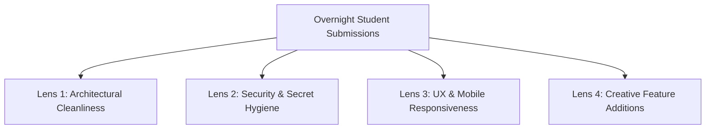

# 3.1 Audience Project Review Clinic

<div class="session-banner">
  <div class="banner-header">
    <svg xmlns="http://www.w3.org/2000/svg" width="18" height="18" viewBox="0 0 24 24" fill="none" stroke="currentColor" stroke-width="2" stroke-linecap="round" stroke-linejoin="round"><circle cx="12" cy="12" r="10"></circle><polygon points="10 8 16 12 10 16 10 8"></polygon></svg>
    <strong class="banner-title">Session Focus: Peer Code Review & Diagnostic Clinic</strong>
  </div>
  Welcome to Day 3! We begin by analyzing community project submissions created overnight, evaluating real-world architectural strengths, and resolving common edge cases.
</div>

## The Review Clinic Structure

Live code reviews provide immediate, high-retention feedback. During this opening session, Priyanshu and Armaan review projects across four core evaluation lenses:



---

## Top 4 Common Pitfalls Observed in Student Code

### 1. Hardcoded API Keys in `app.js`
- **The Issue**: Students often replace `localStorage.getItem()` with their raw key `const apiKey = "AIzaSy..."` to save time while testing.
- **The Danger**: When pushing to a public GitHub repository, automated bots scrape that key within 90 seconds.
- **The Fix**: Enforce localStorage inputs or environment variables (`.env`) before pushing to GitHub.

### 2. Broken State on Asynchronous Errors
- **The Issue**: When Gemini rate-limits or the network drops, the application freezes in a perpetual "Thinking..." state with buttons disabled.
- **The Fix**: Always use `try / catch / finally` to ensure loading spinners are dismissed and user input is re-enabled:
```javascript
// Pattern: defensive finally block
try {
  setLoadingState(true);
  await queryGemini(prompt);
} catch (err) {
  renderErrorToast(err.message);
} finally {
  setLoadingState(false); // Guarantees UI resets even on error
}
```

### 3. Mobile Viewport Overflow
- **The Issue**: Textarea or sidebars overflowing horizontally on phone screens (`375px` width) because widths were set in fixed pixels (`width: 500px`) instead of fluid percentages (`max-width: 100%`).
- **The Fix**: Use `box-sizing: border-box` and CSS media queries.

### 4. Raw HTML Injection Vulnerability (XSS)
- **The Issue**: Rendering user messages with `card.innerHTML = userText;`.
- **The Danger**: If an attendee types `<script>alert('hack')</script>`, malicious scripts execute in the DOM.
- **The Fix**: Always use `element.textContent = userText;` for untrusted input.

---

## Hands-On Diagnostic Code Review

Here is how to approach reviewing and patching an edge case in a real codebase:

1. Clone the submitted repository: `git clone [repository_url]`
2. Inspect browser DevTools to isolate the runtime exception and line number.
3. Pass a targeted diagnostic prompt to your AI assistant:
```text
In @app.js, line 48 throws: "TypeError: Cannot read properties of null".
Inspect the DOM query and provide a defensive fallback if the element does not exist.
```
4. Verify the surgical patch locally, ensure zero side-effects, and commit the fix.
