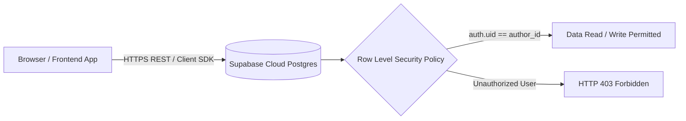

# 3.1 Database Schema Design & Supabase Integration (RLS)

<div class="session-banner">
  <div class="banner-header">
    <svg xmlns="http://www.w3.org/2000/svg" width="18" height="18" viewBox="0 0 24 24" fill="none" stroke="currentColor" stroke-width="2" stroke-linecap="round" stroke-linejoin="round"><circle cx="12" cy="12" r="10"></circle><polygon points="10 8 16 12 10 16 10 8"></polygon></svg>
    <strong class="banner-title">Day 3 Milestone: Cloud Persistence & Database Security</strong>
  </div>
  Transition from temporary browser localStorage to a production PostgreSQL database. Learn how to prompt AI to architect relational schemas, provision tables in Supabase, and configure Row Level Security (RLS) to protect user data.
</div>

## The Backend Architecture



---

## 1. Database Schema Design with AI

When prompting an AI to design a database schema, do not say *"give me tables for my app"*. Specify data relationships, constraints, indexes, and cascades explicitly.

### Prompt Pattern: SQL Migration Generation
<div class="prompt-box">
  <div class="prompt-label">Database Schema Prompt</div>
  Context: Building a fullstack AI chat and note-taking MVP with Supabase PostgreSQL.<br><br>
  Task: Write a production-grade PostgreSQL migration script that creates:<br>
  1. <code>profiles</code> table: <code>id</code> (UUID references auth.users.id primary key), <code>email</code> (text), <code>full_name</code> (text), <code>created_at</code> (timestamptz default now()).<br>
  2. <code>conversations</code> table: <code>id</code> (UUID default gen_random_uuid() primary key), <code>user_id</code> (UUID references profiles.id on delete cascade), <code>title</code> (text), <code>created_at</code> (timestamptz default now()).<br>
  3. <code>messages</code> table: <code>id</code> (UUID default gen_random_uuid()), <code>conversation_id</code> (UUID references conversations.id on delete cascade), <code>role</code> (text check (role in ('user', 'model'))), <code>content</code> (text), <code>created_at</code> (timestamptz default now()).<br><br>
  Security Requirements:<br>
  - Enable Row Level Security (RLS) on all three tables.<br>
  - Output standard PostgreSQL syntax with indexes on foreign keys.
</div>

### Generated PostgreSQL Migration Script

```sql
-- 1. Profiles Table linked to Supabase Auth
create table public.profiles (
  id uuid references auth.users on delete cascade primary key,
  email text,
  full_name text,
  created_at timestamptz default timezone('utc'::text, now()) not null
);

-- 2. Conversations Table
create table public.conversations (
  id uuid default gen_random_uuid() primary key,
  user_id uuid references public.profiles(id) on delete cascade not null,
  title text not null default 'New Conversation',
  created_at timestamptz default timezone('utc'::text, now()) not null
);

-- 3. Messages Table
create table public.messages (
  id uuid default gen_random_uuid() primary key,
  conversation_id uuid references public.conversations(id) on delete cascade not null,
  role text not null check (role in ('user', 'model')),
  content text not null,
  created_at timestamptz default timezone('utc'::text, now()) not null
);

-- Create performance indexes for relational joins
create index idx_conversations_user on public.conversations(user_id);
create index idx_messages_conversation on public.messages(conversation_id);
```

---

## 2. Row Level Security (RLS) Basics: Protecting User Privacy

> [!CAUTION]
> **The Most Critical Security Hurdle for Beginners**:  
> By default, if RLS is not enabled on a Supabase table, any visitor with your public Anon Key can read, update, or delete **every user's records** using the standard JavaScript client!

### Enabling RLS
Run this command for every table in the Supabase SQL Editor:

```sql
alter table public.profiles enable row level security;
alter table public.conversations enable row level security;
alter table public.messages enable row level security;
```

### Authoring RLS Policies: The User A vs. User B Rule
We must ensure that **User A can NEVER view or modify User B's data**:

```sql
-- Policy 1: Users can read and update ONLY their own profile
create policy "Users can view own profile"
  on public.profiles for select
  using (auth.uid() = id);

create policy "Users can update own profile"
  on public.profiles for update
  using (auth.uid() = id);

-- Policy 2: Users can only view their own conversations
create policy "Users can view own conversations"
  on public.conversations for select
  using (auth.uid() = user_id);

create policy "Users can insert own conversations"
  on public.conversations for insert
  with check (auth.uid() = user_id);

-- Policy 3: Users can only access messages from their own conversations
create policy "Users can view messages from their conversations"
  on public.messages for select
  using (
    exists (
      select 1 from public.conversations
      where conversations.id = messages.conversation_id
      and conversations.user_id = auth.uid()
    )
  );
```

---

## 3. Connecting Supabase to Your Local Application

### Step 1: Obtain Project Credentials
1. Open your Supabase Dashboard &rarr; **Project Settings** &rarr; **API**.
2. Copy the **Project URL** (`https://xyzcompany.supabase.co`).
3. Copy the **Project API anon/public key** (`eyJhbGciOi...`).

### Step 2: Configure Local Environment Variables
Create `.env.local` in your project root:

```ini
# .env.local - Ignored by Git
NEXT_PUBLIC_SUPABASE_URL=https://xyzcompany.supabase.co
NEXT_PUBLIC_SUPABASE_ANON_KEY=eyJhbGciOi...
```

### Step 3: Initialize the Supabase Client
Prompt your AI agent to create a unified database client in `lib/supabaseClient.js`:

```javascript
import { createClient } from '@supabase/supabase-js';

const supabaseUrl = process.env.NEXT_PUBLIC_SUPABASE_URL;
const supabaseAnonKey = process.env.NEXT_PUBLIC_SUPABASE_ANON_KEY;

export const supabase = createClient(supabaseUrl, supabaseAnonKey);
```

### Step 4: Insert Seed Data and Verify Persistence
Run a test query in your application to confirm that data persists into Supabase:

```javascript
async function saveMessage(conversationId, role, text) {
  const { data, error } = await supabase
    .from('messages')
    .insert([
      { conversation_id: conversationId, role: role, content: text }
    ]);
    
  if (error) console.error('Database Error:', error.message);
  return data;
}
```

Once records appear in the Supabase Table Editor, your backend persistence is verified and ready for cloud deployment!
