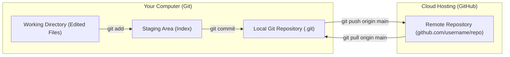
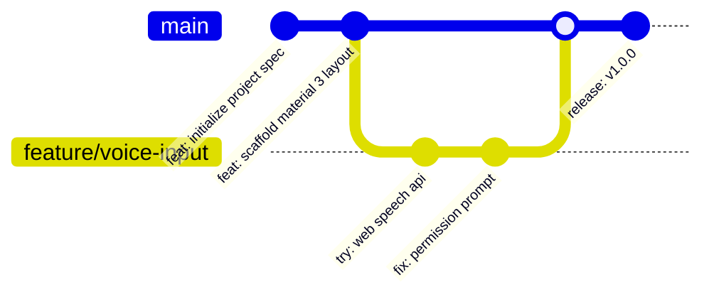

# 3.2 Git & GitHub Mastery for Vibecoders

<div class="session-banner">
  <div class="banner-header">
    <svg xmlns="http://www.w3.org/2000/svg" width="18" height="18" viewBox="0 0 24 24" fill="none" stroke="currentColor" stroke-width="2" stroke-linecap="round" stroke-linejoin="round"><circle cx="12" cy="12" r="10"></circle><polygon points="10 8 16 12 10 16 10 8"></polygon></svg>
    <strong class="banner-title">Session Focus: Version Control & GitHub Publishing</strong>
  </div>
  Master Git commands, remote repositories, and atomic checkpointing. Learn how version control provides an instant safety net against AI regressions.
</div>

## Part 1: Git vs. GitHub — The Fundamental Difference

Many computer science students conflate Git and GitHub:



- **Git**: The local command-line version control software running on your computer. It creates immutable snapshots (commits) of your codebase so you can jump back to any point in time.
- **GitHub**: A cloud platform that hosts Git repositories online, enabling remote backup, team collaboration, pull requests, and automated continuous deployment (CI/CD).

---

## Part 2: The Vibecoder's Git Workflow

In AI-assisted engineering, Git serves as both an instant safety net against AI regressions and an automated pipeline to cloud hosting:



---

## 5 Critical Git Commands Every Developer Must Know

```bash
# 1. Check current repository status and modified files
git status

# 2. Stage all modifications
git add .

# 3. Commit changes with a descriptive semantic message
git commit -m "feat: integrate Gemini 2.0 streaming API with error recovery"

# 4. Create and switch to a speculative experimental branch
git checkout -b experiment/dark-theme

# 5. Undo uncommitted modifications and reset to last clean commit
git reset --hard HEAD
```

---

## Publishing to GitHub in 60 Seconds

### Method A: Using the GitHub CLI (`gh`)
If you have the official GitHub CLI installed:

```bash
# Authenticate with GitHub
gh auth login

# Create a new public repository from your current directory and push code
gh repo create omnivibe-studio --public --source=. --remote=origin --push
```

### Method B: Using GitHub Web Interface
1. Go to [github.com/new](https://github.com/new).
2. Repository name: `omnivibe-studio`.
3. Set visibility to **Public**.
4. Leave "Add a README" unchecked.
5. In your local terminal, link the remote and push:
```bash
git remote add origin https://github.com/YOUR_USERNAME/omnivibe-studio.git
git branch -M main
git push -u origin main
```

---

## Structuring a High-Impact Project `README.md`

A professional README turns a simple code repository into a portfolio-worthy asset:

```markdown
# OmniVibe AI Studio

> An interactive developer AI workspace powered by Google Gemini 2.0 Flash (1M tokens free tier). Built during the GDG BITS Pilani Dubai Campus Vibecoding 101 workshop.

## Features
- **Real-Time Streaming**: Instant code generation with sub-second latency.
- **Multimodal Vision**: Drag-and-drop screenshots and architectural diagrams for instant analysis.
- **Google Material 3**: Full light/dark mode support with persistent state.

## Live Demo
Check out the live application: [https://your-app.vercel.app](https://your-app.vercel.app)

## Tech Stack
- Frontend: Vanilla HTML5, CSS Variables, ES6 JavaScript Modules
- AI Model: Google Gemini 2.0 Flash (v1beta REST API)
- Hosting: Vercel Global Edge Network

## Workshop Credits
Built with guidance from [Priyanshu](https://github.com/prxcode) and Armaan at GDG BITS Pilani Dubai Campus.
```
