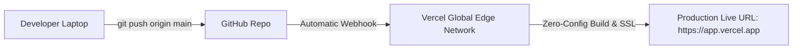

# 3.3 Zero-to-Live on Vercel & Cloud

<div class="session-banner">
  <div class="banner-header">
    <svg xmlns="http://www.w3.org/2000/svg" width="18" height="18" viewBox="0 0 24 24" fill="none" stroke="currentColor" stroke-width="2" stroke-linecap="round" stroke-linejoin="round"><circle cx="12" cy="12" r="10"></circle><polygon points="10 8 16 12 10 16 10 8"></polygon></svg>
    <strong class="banner-title">Session Focus: Zero-to-Live Production Deployments</strong>
  </div>
  Turn your local project into a live, publicly accessible HTTPS application in under 5 minutes using Vercel's global edge network and automated GitHub CI/CD.
</div>

## The Continuous Deployment Architecture

When you connect GitHub to Vercel, your production deployment becomes fully automated:



---

## Method 1: Web Dashboard Deployment (Recommended for Beginners)

1. Navigate to [vercel.com/new](https://vercel.com/new).
2. Click **Continue with GitHub** to authenticate.
3. Locate your `omnivibe-studio` repository and click **Import**.
4. Configure Project Settings:
   - **Framework Preset**: Other (for Vanilla HTML/CSS/JS) or Vite/Next.js if using a framework.
   - **Root Directory**: `./`
5. Click **Deploy**.
6. Within 15 seconds, Vercel provides your live production domain (e.g., `https://omnivibe-studio.vercel.app`).

---

## Method 2: Terminal Deployment via Vercel CLI (Fastest)

If you prefer terminal commands without leaving your editor:

```bash
# Run Vercel CLI directly via npx
npx vercel

# Follow the interactive prompts:
# ? Set up and deploy "~/omnivibe-studio"? [Y/n] y
# ? Which scope do you want to deploy to? [Your Account]
# ? Link to existing project? [y/N] n
# ? What's your project's name? omnivibe-studio
# ? In which directory is your code located? ./

# Deploy immediately to production
npx vercel --prod
```

---

## Deploying MkDocs Documentation to GitHub Pages

If you want to host your workshop documentation or project guides for free on GitHub Pages:

```bash
# Install mkdocs-material
pip install -r requirements.txt

# One command builds static HTML and publishes to gh-pages branch
python -m mkdocs gh-deploy --clean
```

Your documentation site is instantly available at `https://<github_username>.github.io/<repo_name>/` with full search indexing and responsive layout.
