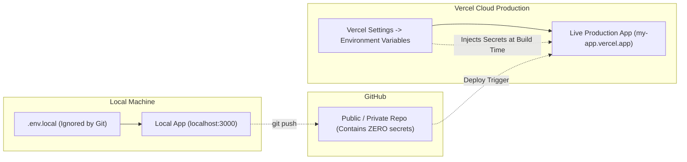
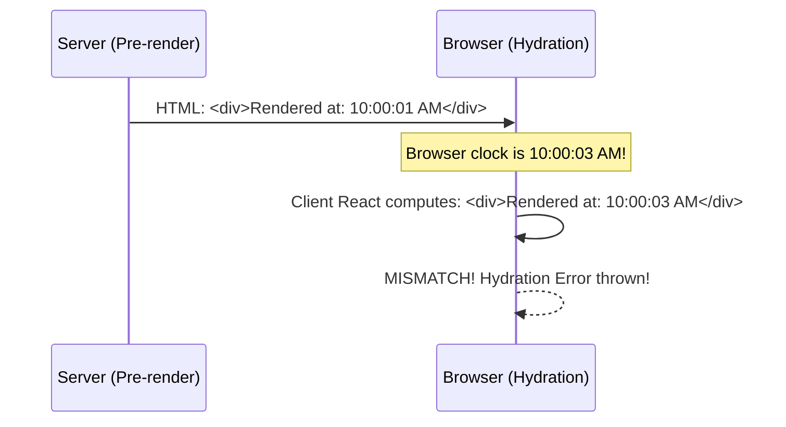

# 3.4 Environment Variables, Hydration Errors & Production QA

<div class="session-banner">
  <div class="banner-header">
    <svg xmlns="http://www.w3.org/2000/svg" width="18" height="18" viewBox="0 0 24 24" fill="none" stroke="currentColor" stroke-width="2" stroke-linecap="round" stroke-linejoin="round"><circle cx="12" cy="12" r="10"></circle><polygon points="10 8 16 12 10 16 10 8"></polygon></svg>
    <strong class="banner-title">Production Hardening: Secrets, Hydration & Live QA</strong>
  </div>
  Taking an AI-generated application to production requires more than hitting deploy. In this module, you will master secret mapping between local and Vercel environments, diagnose common React hydration mismatches, and run a final quality audit before presenting live.
</div>

## 1. Local Secrets vs. Production Cloud Secrets

A common beginner hurdle is configuring environment variables in local development, only for the live Vercel app to crash with `500 Server Error` or missing database connections.



### Mapping Supabase Keys to Vercel
When deploying your Supabase-backed application:

1. **Locally (`.env.local`)**:
   ```ini
   NEXT_PUBLIC_SUPABASE_URL=https://your-project.supabase.co
   NEXT_PUBLIC_SUPABASE_ANON_KEY=eyJhbGciOi...
   GEMINI_API_KEY=AIzaSy...
   ```
2. **In Vercel Dashboard**:
   - Open your project on Vercel &rarr; **Settings** &rarr; **Environment Variables**.
   - Add `NEXT_PUBLIC_SUPABASE_URL` with your Supabase URL.
   - Add `NEXT_PUBLIC_SUPABASE_ANON_KEY` with your Supabase Anon Key.
   - Add `GEMINI_API_KEY` with your Google AI Studio key.
   - Scope them to **Production**, **Preview**, and **Development**, then click **Save**.

> [!IMPORTANT]
> Any variable prefixed with `NEXT_PUBLIC_` is bundled into client-side JavaScript sent to the browser. Only prefix variables that are safe for the public to read (like your Supabase Anon Key and Project URL). **Never** prefix database admin keys or paid private API keys with `NEXT_PUBLIC_`.

---

## 2. Handling Hydration Errors in AI-Generated React/Next.js

When asking an AI to build modern React or Next.js applications, the most frequent build-breaking bug is the dreaded **Hydration Mismatch Error**:

```text
Error: Hydration failed because the initial UI does not match what was rendered on the server.
Warning: Text content did not match. Server: "6/15/2026" Client: "6/16/2026"
```

### What is a Hydration Error?
In modern fullstack frameworks (Next.js, Remix, Astro), the server pre-renders HTML strings to send to the browser. When JavaScript loads in the browser, React "hydrates" that HTML with event listeners. If the HTML generated on the server differs from what the browser computes on the first render, React throws an exception and page rendering breaks.



### The 3 Common AI Hydration Traps
1. **Dynamic Timestamps & Dates**:
   - *Bad AI Code*: `<span>{new Date().toLocaleDateString()}</span>`
   - *Why it breaks*: Server time zone differs from user's local browser time zone.
   - *Fix*: Format dates only inside a `useEffect` hook or pass a static server timestamp.
2. **Accessing `window` or `localStorage` during initial render**:
   - *Bad AI Code*: `const theme = localStorage.getItem('theme') || 'light';`
   - *Why it breaks*: The Node.js server has no `window` or `localStorage`!
   - *Fix*: Mount client-side state after hydration completes:
     ```javascript
     const [isMounted, setIsMounted] = useState(false);
     useEffect(() => { setIsMounted(true); }, []);
     if (!isMounted) return null; // or placeholder skeleton
     ```
3. **Random IDs or Math.random()**:
   - *Bad AI Code*: `<div id={`card-${Math.random()}`}>`
   - *Fix*: Use React 18's native `useId()` hook: `const id = useId();`.

### Prompt Pattern to Fix Hydration Mismatches
<div class="prompt-box">
  <div class="prompt-label">Hydration Error Fix Prompt</div>
  Context: In @components/MessageList.tsx, we are getting a Next.js hydration error:<br><br>
  <code>
  Error: Text content did not match. Server: "..." Client: "..."
  </code><br><br>
  Task:<br>
  1. Identify where client-only state (e.g. localStorage or date formatting) is accessed during SSR.<br>
  2. Implement a clean `hasMounted` pattern using `useEffect` or wrap the dynamic component in a client-side dynamic import (`ssr: false`).<br>
  3. Ensure the initial server markup matches the client markup perfectly before state updates.
</div>

---

## 3. Final QA & Polish Checklist (Pre-Presentation)

Before sharing your live Vercel URL with the audience and judges:

- [x] **1. Live URL Test**: Open `https://your-app.vercel.app` in an Incognito / Private window to verify it works without cached local state.
- [x] **2. Console Audit**: Open DevTools (`F12`), submit a query, and verify **zero red uncaught errors** in the console.
- [x] **3. Supabase Record Verification**: Check your Supabase Dashboard Table Editor to confirm that data inserted during your live test is physically stored in PostgreSQL.
- [x] **4. Mobile Responsiveness**: Toggle device toolbar in DevTools (`Ctrl+Shift+M`) to ensure input docks and cards do not overflow on mobile screens (375px width).
- [x] **5. Graceful Error States**: Submit a test with network disconnected; ensure a readable error banner appears rather than a silent crash.
