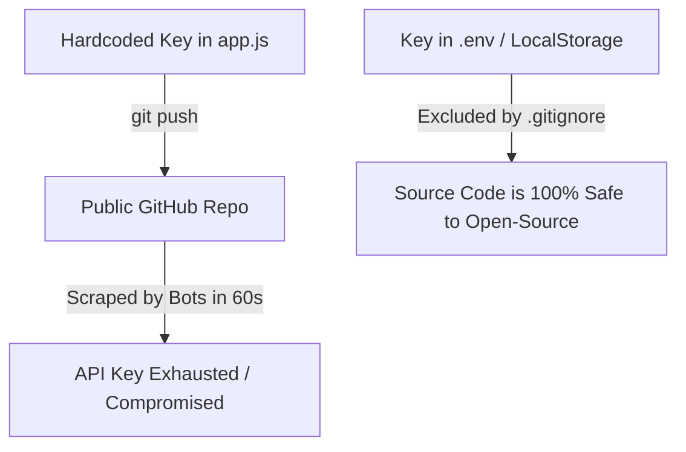

# 3.4 Environment Variables & Secret Security

<div class="session-banner">
  <div class="banner-header">
    <svg xmlns="http://www.w3.org/2000/svg" width="18" height="18" viewBox="0 0 24 24" fill="none" stroke="currentColor" stroke-width="2" stroke-linecap="round" stroke-linejoin="round"><circle cx="12" cy="12" r="10"></circle><polygon points="10 8 16 12 10 16 10 8"></polygon></svg>
    <strong class="banner-title">Session Focus: Environment Variables & Secret Hygiene</strong>
  </div>
  Decouple sensitive credentials from source code. Learn how to configure .env files, enforce .gitignore boundaries, and protect API keys in cloud environments.
</div>

## The Mechanics of Secret Exposure

When a developer hardcodes an API key into frontend code and runs `git push origin main`:
1. Automated security crawlers index public GitHub commits within 60 to 90 seconds.
2. Compromised cloud credentials are used to spin up unauthorized GPU instances or exhaust monthly token quotas.
3. Simply making another commit that deletes the key does not remove it from your Git commit history.



---

## The Standard Three-File Environment Pattern

To maintain clean secret boundaries, use this three-file pattern:

### 1. `.gitignore` (Checked into Git)
Guarantees that local configuration files containing real secrets are never tracked:
```gitignore
# Exclude environment configuration
.env
.env.local
*.local
node_modules/
dist/
```

### 2. `.env.example` (Checked into Git)
A documented template explaining required variables without actual secrets:
```ini
# Template for required environment variables
GEMINI_API_KEY=your_gemini_api_key_from_ai_studio
APP_PORT=3000
```

### 3. `.env` or `.env.local` (Never Checked into Git)
Your actual personal keys for local development:
```ini
# Local secret (Never push to git)
GEMINI_API_KEY=AIzaSyB8xQZ12345RealKeyExample
```

---

## Configuring Secrets in Vercel Production

When deploying to Vercel, sensitive variables are configured through the cloud dashboard rather than files:

1. In your Vercel Project Dashboard, click **Settings**.
2. Navigate to **Environment Variables** in the left menu.
3. Click **Add New Variable**:
   - **Key**: `GEMINI_API_KEY`
   - **Value**: `AIzaSy...` (Your real Google AI Studio key)
   - **Environment**: Check *Production*, *Preview*, and *Development*.
4. Click **Save**.

Vercel securely injects these values into your serverless functions at runtime without exposing them to browser clients.

---

## Client-Side Security: Why LocalStorage was used for Day 2

In pure client-side applications without a backend server (like our Day 2 OmniVibe Studio), having each user enter their own key into **Settings (localStorage)** ensures:
- The app owner's personal API quota is never drained by public visitors.
- The key never leaves the user's local browser instance.
- The repository can be 100% public on GitHub without risk of secret leakage.
