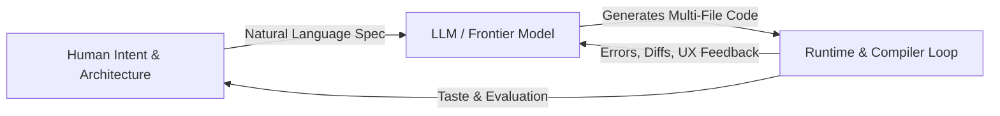

# Vibecoding 101: The AI-First Builder Masterclass

  GDG BITS Pilani Dubai Campus
  3-Day Masterclass
  2-Hour Live Build
  Production Shipping
  
  <h2 style="margin-top: 0.8rem; margin-bottom: 0.4rem; font-weight: 700;">Welcome to Vibecoding 101</h2>
  

    From syntax memorization to AI orchestration. Learn how to architect, steer, debug, and ship production software at the speed of thought using free high-token frontier models, live multi-file editing, and autonomous workflows.
  

  

    <strong>Workshop Conducted by:</strong> 
    <a href="https://github.com/prxcode" target="_blank" rel="noopener" style="font-weight: 600; text-decoration: underline;">Priyanshu</a> 
    and <strong>Armaan</strong> &bull; GDG BITS Pilani Dubai Campus
  

  
  <a href="day-1/01-what-is-vibecoding.md" class="gdg-btn">Start Day 1 &rarr;</a>
  <a href="#workshop-curriculum-at-a-glance" class="gdg-btn gdg-btn-outline" style="margin-left: 0.5rem;">View Agenda</a>

  

    <svg xmlns="http://www.w3.org/2000/svg" width="18" height="18" viewBox="0 0 24 24" fill="none" stroke="currentColor" stroke-width="2" stroke-linecap="round" stroke-linejoin="round"><circle cx="12" cy="12" r="10"></circle><line x1="12" y1="16" x2="12" y2="12"></line><line x1="12" y1="8" x2="12.01" y2="8"></line></svg>
    <strong class="banner-title">Zero-to-Hero Roadmap for CSE Students (1st, 2nd & 3rd Year)</strong>
  

  This curriculum is engineered to take university students across all levels from ground-zero basics to frontier autonomous systems:
  <ul style="margin: 0.5rem 0 0 1.2rem; padding: 0; line-height: 1.6;">
    <li><strong>1st Year CSE (Freshers)</strong>: What is source code vs machine binary, how compilers and runtimes work, what an IDE is (VS Code, Google Antigravity, Cursor vs Notepad), and what an API/JSON is.</li>
    <li><strong>2nd Year CSE (Sophomores)</strong>: How AI IDEs index repos using ASTs, prompt and context engineering (.cursorrules, AGENTS.md), and building real apps using Google Gemini 2.0 Flash (1M free tokens).</li>
    <li><strong>3rd Year CSE (Juniors)</strong>: Spec-Driven Development, Model Context Protocol (MCP & JSON-RPC 2.0), autonomous agent ReAct loops, multi-agent subagent hierarchies, and production CI/CD deployments.</li>
  </ul>

---

## What is Vibecoding?

> "There is a new kind of coding I call 'vibecoding', where you fully give in to the vibes, embrace the LLM, and forget that the code even exists. You just talk, iterate, watch it work, and steer."  
> — **Andrej Karpathy** (Co-founder OpenAI, former Director of AI at Tesla)

True professional vibecoding is the discipline of **Context Engineering**, **Spec-Driven Architecture**, and **Deterministic Evaluation**. The AI handles repetitive boilerplate; you provide systems architecture, security boundaries, and product taste.

---

## Workshop Curriculum at a Glance

  

    

      Day 1
      Masterclass
    

    <h3 style="margin: 0.75rem 0 0.5rem 0;">Fundamentals & Tech Ecosystem</h3>
    

      Master all core concepts in one intensive session. Learn token mechanics, KV caching, hallucination triggers, system rules (.cursorrules, AGENTS.md), and explore free high-token models like Gemini 2.0 Flash (1M tokens free tier).
    

    <a href="day-1/01-what-is-vibecoding.md" style="font-weight: 600; color: #4285F4; text-decoration: none;">Explore Day 1 Modules &rarr;</a>
  

  

    

      Day 2
      Live Build
    

    <h3 style="margin: 0.75rem 0 0.5rem 0;">2-Hour Live Product Build</h3>
    

      Watch an end-to-end fullstack AI application ("OmniVibe AI Studio") built live in 120 minutes. Integrating free Google AI Studio Gemini 2.0 Flash APIs, live streaming, vision analysis, error recovery, and UI polish.
    

    <a href="day-2/01-live-build-overview.md" style="font-weight: 600; color: #EA4335; text-decoration: none;">Explore Day 2 Modules &rarr;</a>
  

  

    

      Day 3
      Production & Review
    

    <h3 style="margin: 0.75rem 0 0.5rem 0;">Shipping, Reviews & Vercel Deploy</h3>
    

      Live Code Review Clinic of projects built by attendees overnight. Master Git/GitHub workflows, 1-click deployments to Vercel, and environment variable (.env) secret hygiene.
    

    <a href="day-3/01-audience-project-review-clinic.md" style="font-weight: 600; color: #34A853; text-decoration: none;">Explore Day 3 Modules &rarr;</a>
  

---

## Complete 3-Day Schedule

| Day | Module | Focus Area | Deliverable |
| :--- | :--- | :--- | :--- |
| **Day 1** | [1.1 Foundations: From IDEs to Vibecoding](day-1/01-what-is-vibecoding.md) | Ground-zero basics: IDEs, compilers, runtimes & the AI paradigm shift | Foundational mindset |
| **Day 1** | [1.2 LLMs & Free High-Token Models](day-1/02-tools-and-environment.md) | Transformer mechanics, Gemini 2.0 Flash 1M tokens free tier, IDE setup | Configured AI toolchain |
| **Day 1** | [1.3 Prompting, Rules & Context](day-1/03-prompting-and-context-engineering.md) | .cursorrules, AGENTS.md, negative constraints & symbol pinning | Custom project rules |
| **Day 1** | [1.4 Architecture: APIs, Specs & MCP](day-1/04-architecture-spec-and-mcp.md) | Client-server APIs, JSON, Spec-Driven Development & Model Context Protocol | Production PRD template |
| **Day 1** | [1.5 Hands-On Warm-up (20 Min)](day-1/05-hands-on-rapid-prototyping.md) | Rapid build: PromptVault Lite using clean 3-file architecture | Running prototype |
| **Day 1** | [1.6 Setup & Readiness Checklist](day-1/06-day1-prep-and-readiness.md) | Free Google AI Studio API key verification & Git environment test | Verified workstation |
| **Day 2** | [2.1 Live Build Blueprint](day-2/01-live-build-overview.md) | OmniVibe Studio architecture, zero-cost stack & 120-min roadmap | Architectural spec |
| **Day 2** | [2.2 Phase 1: Live Spec & Scaffolding](day-2/02-phase-1-spec-and-scaffolding.md) | Feature ideation, SPEC.md & Google Material 3 layout | Running workspace UI |
| **Day 2** | [2.3 Phase 2: Live Gemini Integration](day-2/03-phase-2-live-gemini-integration.md) | Gemini 2.0 Flash REST API, streaming response & error handling | Live AI intelligence |
| **Day 2** | [2.4 Phase 3: Multimodal Vision & Polish](day-2/04-phase-3-multimodal-and-polish.md) | Drag-and-drop image analysis, Markdown export & dark mode | Complete fullstack app |
| **Day 2** | [2.5 Diagnostic Error Handling](day-2/05-debugging-and-steering-models.md) | Resolving hallucination loops, compiler traces & context resets | Error recovery playbook |
| **Day 2** | [2.6 Backup Code & Overnight Challenge](day-2/06-phase-4-wrapup-and-overnight-challenge.md) | Full verified codebase checkpoint & student hackathon assignment | Overnight challenge |
| **Day 3** | [3.1 Audience Project Review Clinic](day-3/01-audience-project-review-clinic.md) | Peer review of overnight student repositories & live diagnostic clinic | Code quality audit |
| **Day 3** | [3.2 Git & GitHub Mastery](day-3/02-git-and-github-mastery.md) | Git vs GitHub, commits, branches, PRs & portfolio README | Published GitHub repo |
| **Day 3** | [3.3 Zero-to-Live on Vercel](day-3/03-shipping-to-vercel-and-cloud.md) | Vercel CLI, automated GitHub CI/CD & custom domains | Public HTTPS live URL |
| **Day 3** | [3.4 Environment Variables & Secrets](day-3/04-environment-variables-and-secrets.md) | .env management, preventing credential scraping & Vercel secrets | Secure cloud deployment |
| **Day 3** | [3.5 Autonomous Agents & Workflows](day-3/05-agentic-workflows-and-subagents.md) | Chatbots vs Agents, ReAct loops & autonomous self-healing tests | Multi-agent workflows |
| **Day 3** | [3.6 Vibecoder's Handbook & Next Steps](day-3/06-vibecoders-handbook-and-next-steps.md) | The 10 Commandments, Solution Challenge & GDG community pathway | Certificate & roadmap |

---

## Speaker Details

- **Instructor**: Priyanshu — GitHub: [github.com/prxcode](https://github.com/prxcode)
- **Co-Instructor**: Armaan
- **Chapter**: GDG BITS Pilani Dubai Campus
- **Inquiries & Doubts**: Post directly in the comments section below or join the community discord.
