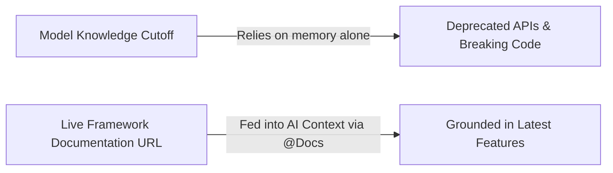
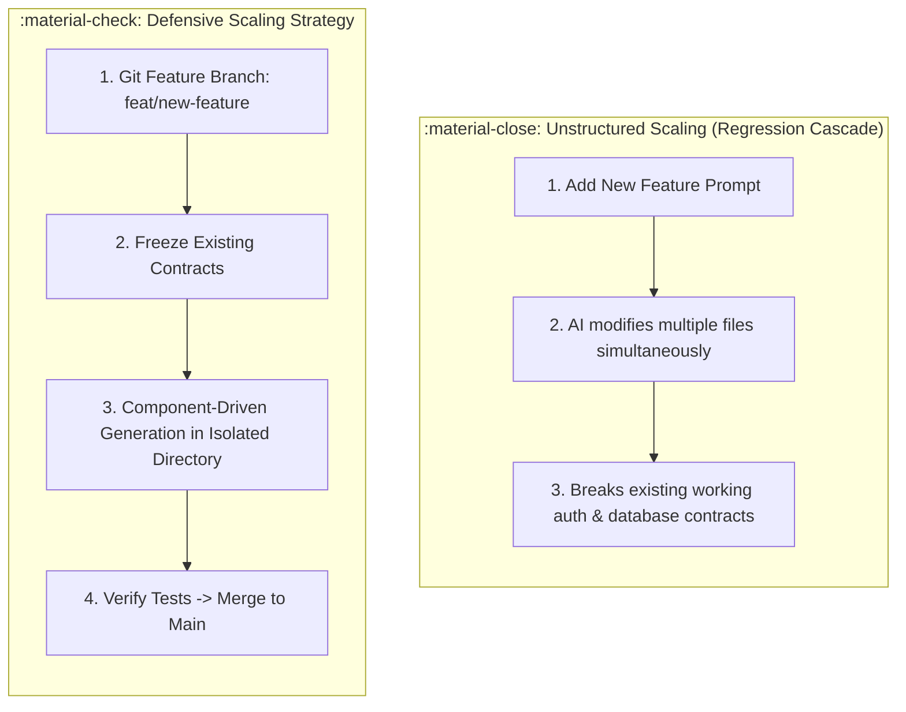

# Beyond Vibecoding 101: Documentation, Scaling & Open Source

<div class="session-banner">
  <div class="banner-header">
    <svg xmlns="http://www.w3.org/2000/svg" width="18" height="18" viewBox="0 0 24 24" fill="none" stroke="currentColor" stroke-width="2" stroke-linecap="round" stroke-linejoin="round"><circle cx="12" cy="12" r="10"></circle><polygon points="10 8 16 12 10 16 10 8"></polygon></svg>
    <strong class="banner-title">Post-Workshop Roadmap: Long-Term AI-First Engineering</strong>
  </div>
  Shipping your first MVP is only step one. In this final module, you will learn how to overcome AI model knowledge cutoffs using live documentation, scale your codebase safely without breaking existing features, and engage with the open-source community.
</div>

## 1. How to Read Official Documentation with AI

Every AI model—regardless of parameter count—has a **knowledge cutoff date**. When frameworks release major breaking changes (such as Next.js migrating from Pages Router to App Router, or Supabase updating auth helpers), models default to deprecated syntax.



### The Live Documentation Ingestion Workflow
Instead of letting the model guess how a new library works:

1. **Find the Canonical Docs Page**: Navigate to the official release page or documentation reference (e.g., `https://supabase.com/docs/guides/auth`).
2. **Feed the URL Directly into Your AI**:
   - In Antigravity 2.0, Antigravity IDE, or Antigravity CLI: pass the official documentation link in your prompt:
     ```text
     Context: Reference the official documentation at https://nextjs.org/docs/app/building-your-application/routing/middleware
     
     Task: Implement authentication middleware using the exact patterns shown in the link above.
     DO NOT use deprecated _middleware.ts syntax.
     ```
3. **Download Raw Markdown / OpenAPI Specs**: Most modern developer tools provide raw markdown versions of their docs (`docs.md` or `/llms.txt`). Pinning these files directly guarantees 100% accurate API syntax.

---

## 2. Scaling the MVP Without Breaking Foundations

Once your prototype is live on Vercel, the temptation is to immediately prompt for 10 new features. In an unstructured codebase, this leads to **regression cascades** where adding feature 5 breaks features 1 and 2.



### The 4 Rules for Safe Scaling:
1. **Never Code on `main`**: Always create a feature branch:
   ```bash
   git checkout -b feat/add-export-csv
   ```
2. **Freeze Core Data Contracts**: Lock your TypeScript types (`types/index.ts`) or database models. Instruct the model: *"You may consume existing types, but you must NOT alter them."*
3. **Add End-to-End Smoke Tests**: Write lightweight verification tests (using Playwright or simple Jest assertions) that run automatically on every pull request.
4. **Isolate State**: Avoid creating one giant global state object. Group related state into modular domain hooks (e.g. `useChatSession`, `useTheme`, `useAuth`).

---

## 3. Open Source & Finding Starter Templates

You do not need to build everything from scratch. The open-source ecosystem provides battle-tested AI templates and starter kits:

### Where to Find High-Quality AI Starters
- **Vercel AI SDK Templates** ([vercel.com/templates](https://vercel.com/templates)): Pre-configured Next.js starters with streaming AI, chat interfaces, and Supabase database integrations.
- **Google Antigravity Docs** ([antigravity.google/docs](https://antigravity.google/docs)): Official guidance for Antigravity 2.0, Antigravity IDE, Antigravity CLI, skills, and MCP servers.
- **Google AI Studio Cookbook** ([github.com/google-gemini/cookbook](https://github.com/google-gemini/cookbook)): Official code recipes for multimodal vision, function calling, audio processing, and long-context processing with Gemini 2.0.

### Contributing to AI-Assisted Projects
- When contributing to open-source repos using AI, **disclose your AI usage transparently** in your pull request.
- Ensure every generated line has been reviewed and passes the repository's continuous integration (CI) tests.
- Write human-quality PR descriptions explaining the *why* behind architectural decisions.

<div class="nav-next" markdown>
[Continue to the Vibecoder's Handbook →](02-handbook-and-roadmap.md){ .md-button .md-button--primary }
</div>
