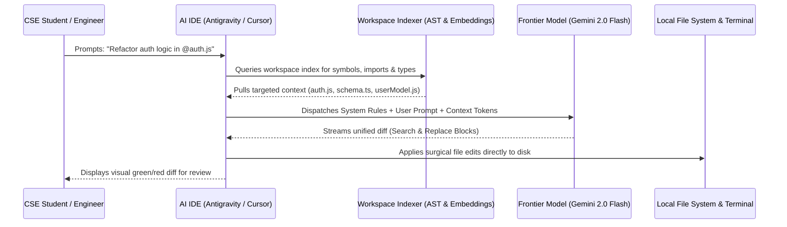
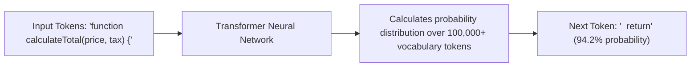
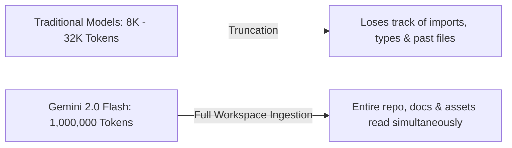

# Under the Hood: LLMs, Free High-Token Models & Tooling

  

    <svg xmlns="http://www.w3.org/2000/svg" width="18" height="18" viewBox="0 0 24 24" fill="none" stroke="currentColor" stroke-width="2" stroke-linecap="round" stroke-linejoin="round"><circle cx="12" cy="12" r="10"></circle><polygon points="10 8 16 12 10 16 10 8"></polygon></svg>
    <strong class="banner-title">Session Focus: The Anatomy of AI Coding Environments</strong>
  

  How does an AI IDE actually write code? We examine the internal mechanics of modern development environments, explore how Transformer models generate code, and benchmark the best zero-cost high-token tools available to students.

## Part 1: How an AI IDE Works Under the Hood

When you ask an AI-native editor like **Google Antigravity**, **Cursor**, or **Windsurf** to build or modify a feature across multiple files, what happens under the hood?

### The 4 Internal Subsystems of an AI IDE

1. **The Context Collector & Symbol Graph**:
    - Scans your active file, cursor position, open tabs, and recent Git commits.
    - Resolves `@` references: when you type `@auth.js`, it loads that file into the context payload.
2. **Abstract Syntax Tree (AST) Indexer**:
    - Traditional text search (`Ctrl+F` or `grep`) matches raw string patterns.
    - An AST indexer parses your code into a hierarchical syntactic tree (Classes, Methods, Arguments, Type Definitions).
    - It can answer: *"Where is the UserInterface contract defined and which files import it?"* without reading thousands of unnecessary lines.
3. **Vector Embeddings & Semantic Search (RAG)**:
    - Code snippets and documentation are converted into high-dimensional numerical vectors (embeddings).
    - When you ask a question in natural language (*"Where do we calculate shopping cart tax?"*), the IDE performs cosine similarity search to fetch relevant code chunks even if the exact keyword differs.
4. **The Surgical Diff Engine**:
    - Instead of rewriting a 2,000-line file from scratch (which costs excessive tokens and introduces subtle typos), the IDE instructs the LLM to output targeted search-and-replace blocks.
    - The diff engine calculates unified patches and applies them directly to disk.

---

## Part 2: How LLMs Write Code (Next-Token Prediction & Mathematics)

Large Language Models (LLMs) are built on the **Transformer architecture** (introduced by Google researchers in 2017 in the foundational paper *"Attention Is All You Need"*).

### What Happens Inside the Model?
1. **Tokenization**: Your input code is converted into numerical tokens via Byte-Pair Encoding (BPE).
2. **High-Dimensional Embeddings**: Each token is mapped to a vector in a space of thousands of dimensions representing syntactic and semantic relationships.
3. **Self-Attention**: The model computes attention scores between every token in the prompt, understanding which variable names relate to which function parameters across distant lines.
4. **Next-Token Probability Distribution**: The model outputs a softmax probability curve across its entire vocabulary (over 100,000 possible tokens).
5. **Temperature Parameter**:
    - `temperature = 0.0`: The model picks strictly the single most probable token (deterministic, ideal for unit tests and math).
    - `temperature = 0.7 - 1.0`: The model introduces randomness, sampling less probable tokens (creative, good for brainstorming).
    - **Vibecoding Rule**: Keep temperature low (`0.1 - 0.3`) for reliable, syntactically correct code generation.

---

## Part 3: Tool Matrix — From Text Editors to Autonomous AI Agents

| Feature / Capability | Plain Notepad | Traditional VS Code | VS Code + Copilot | Cursor / Windsurf | Google Antigravity |
| :--- | :---: | :---: | :---: | :---: | :---: |
| **Syntax Highlighting** | No | Yes | Yes | Yes | Yes |
| **Integrated Terminal** | No | Yes | Yes | Yes | Yes |
| **LSP Type Checking** | No | Yes | Yes | Yes | Yes |
| **Inline Autocomplete** | No | No | Yes (Ghost text) | Yes | Yes |
| **Multi-File Composer** | No | No | No | Yes | Yes |
| **Autonomous Terminal Execution** | No | No | No | Partial | Full Agentic Loop |
| **Self-Healing Test Loops** | No | No | No | No | Yes |
| **Model Context Protocol (MCP)** | No | No | No | Yes | Native Support |

---

## Part 4: The High-Token Breakthrough (Why Context Size Wins)

In traditional LLMs (like standard GPT-3.5 or early models), the context window was limited to **4,000 to 8,000 tokens** (about 10 pages of code). When you loaded 5 files, the model suffered from **Context Truncation**: it literally forgot your imports, resulting in hallucinations.

### The Student Champion: Google Gemini 2.0 Flash (Free Tier)

For students and developers on a budget, **Google Gemini 2.0 Flash** via **Google AI Studio** offers the highest capability-to-cost ratio in the world:

  <h3 style="margin: 0 0 0.5rem 0; color: var(--gdg-blue);">Google Gemini 2.0 Flash Specs (100% Free)</h3>
  <ul style="margin: 0; padding-left: 1.2rem; font-size: 0.95rem; line-height: 1.6;">
    <li><strong>Context Window</strong>: 1,048,576 tokens (over 1 Million tokens).</li>
    <li><strong>Pricing</strong>: Free on Google AI Studio (No credit card or billing required).</li>
    <li><strong>Free Tier Quota</strong>: 15 Requests Per Minute (RPM), 1,500 Requests Per Day (RPD).</li>
    <li><strong>Inference Speed</strong>: Sub-second response generation.</li>
    <li><strong>Native Multimodality</strong>: Ingests code, text documentation, PDF specifications, and UI screenshot images simultaneously.</li>
  </ul>

### Frontier Model Comparison for Software Development

| Model | Provider | Free Tier Context | Strength | Best Used For |
| :--- | :--- | :--- | :--- | :--- |
| **Gemini 2.0 Flash** | Google | **1,000,000 Tokens** | Blazing speed, massive context, multimodal vision | Full-repo indexing, rapid prototyping |
| **Claude 3.7 Sonnet** | Anthropic | Paid / Limited | Deep chain-of-thought architectural reasoning | Tricky refactoring of complex algorithms |
| **GPT-4o** | OpenAI | 8,000 (Free chat) | Broad general programming knowledge | Quick single-file script scaffolding |
| **DeepSeek R1 / V3** | DeepSeek | Variable | High mathematical & competitive algorithmic logic | Offline / local self-hosted setups |

---

## Part 5: Setting Up Your Free Developer Environment

To participate in the workshop without paying for subscriptions, students can use either of these configurations:

### Configuration A: Antigravity / Cursor (Recommended)
- Dedicated AI-first IDE based on VS Code.
- Provides native Composer (`Ctrl+I` / `Cmd+I`) for multi-file workspace modifications.
- Download at [cursor.com](https://cursor.com).

### Configuration B: VS Code + Cline (100% Open-Source & Unlimited)
1. Install standard **VS Code**: [code.visualstudio.com](https://code.visualstudio.com).
2. Install the **Cline** extension from the VS Code Marketplace.
3. In Cline settings, select **Google Gemini** as the API provider.
4. Paste your free Google AI Studio API key and select `gemini-2.0-flash`.
5. You now have a full-featured, autonomous multi-file coding agent with a 1-million-token context window completely free!

---

## Generating Your Free Google AI Studio API Key (2 Minutes)

Every student must have an active key ready for Day 2:

1. Open [aistudio.google.com](https://aistudio.google.com) in your browser.
2. Sign in with your Google account.
3. Click **Get API Key** in the top navigation bar.
4. Click **Create API Key in new project**.
5. Copy the generated key (`AIzaSy...`) and store it securely in your local notes.
