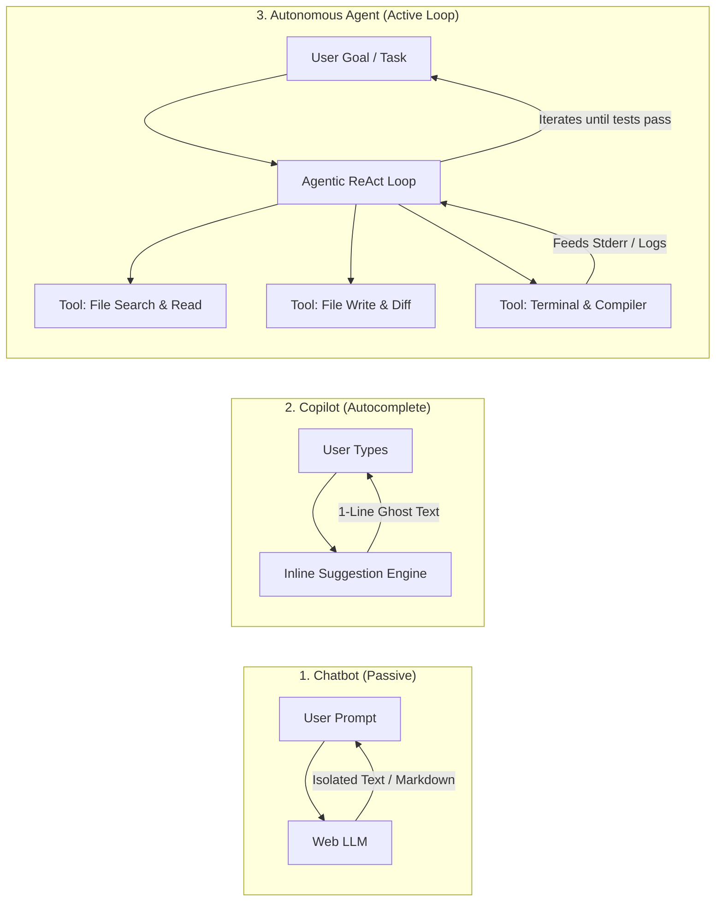
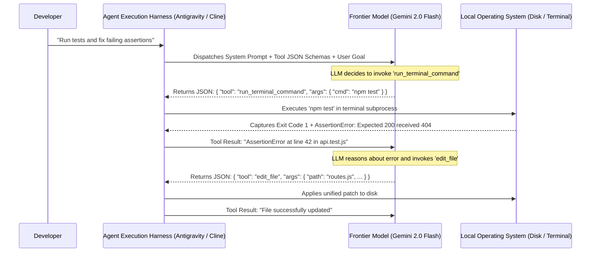
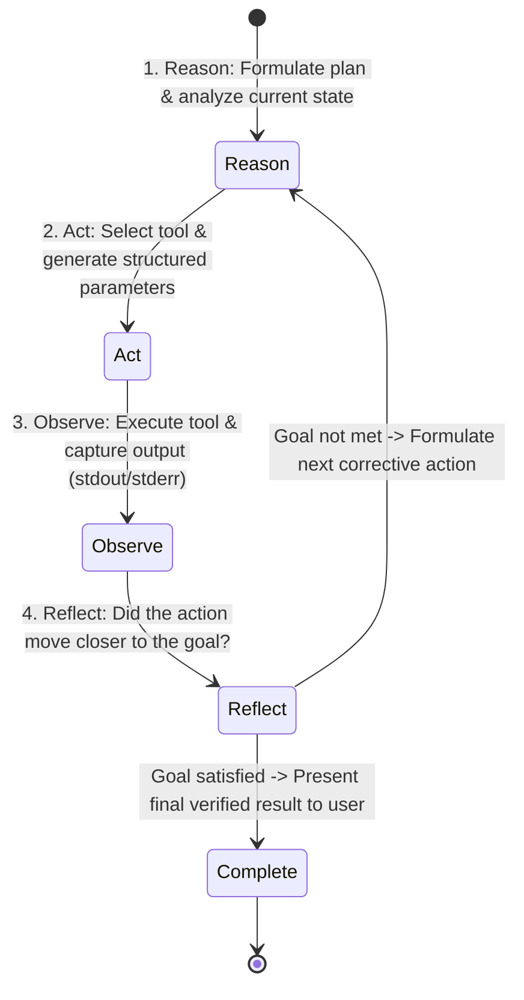
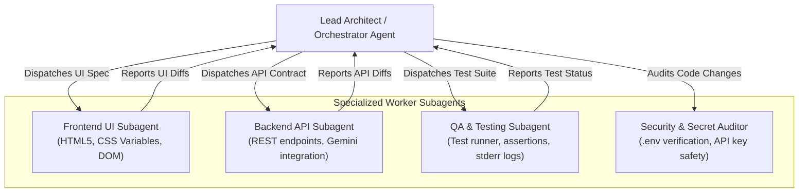
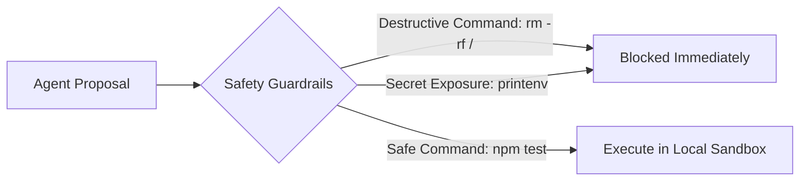

# Autonomous Agents & Self-Healing Workflows

<div class="session-banner">
  <div class="banner-header">
    <svg xmlns="http://www.w3.org/2000/svg" width="18" height="18" viewBox="0 0 24 24" fill="none" stroke="currentColor" stroke-width="2" stroke-linecap="round" stroke-linejoin="round"><circle cx="12" cy="12" r="10"></circle><polygon points="10 8 16 12 10 16 10 8"></polygon></svg>
    <strong class="banner-title">Session Focus: Autonomous Agent Loops & Self-Healing Tests</strong>
  </div>
  Explore the frontier of AI engineering: agentic loops that execute terminal commands, evaluate compiler logs, and self-heal test failures autonomously until tests pass.
</div>

## Part 1: Chatbots vs. Copilots vs. Autonomous Agents

To understand modern AI engineering, students must distinguish between the three generations of AI developer tooling:



| Dimension | Chatbot (ChatGPT / Claude Web) | Copilot (GitHub Copilot) | Autonomous Agent (Google Antigravity / Claude Code / Cline) |
| :--- | :--- | :--- | :--- |
| **Workspace Access** | None (manual copy-paste) | Active file and open tabs | Entire file tree, AST, and Git history |
| **Execution Power** | Zero (cannot run code) | Zero (cannot execute commands) | Full terminal CLI access (`bash`, `npm`, `python`) |
| **Multi-File Edits** | Generates snippets only | Single file inline | Coordinates surgical diffs across 10+ files |
| **Error Recovery** | Passive (user must report error) | None | Active (reads compiler stderr and fixes bugs) |
| **Goal Direction** | Responds to prompts | Suggests next line | Pursues complex multi-step objectives autonomously |

---

## Part 2: How Tool Calling (Function Calling) Actually Works

A common question from CSE students is: *Large Language Models only generate text strings. How can an AI agent actually click buttons, create files, or run terminal commands on your operating system?*

The answer is **Structured Tool Calling**:



### The Tool Schema (JSON Schema)
Before the model generates output, the agent harness injects the JSON definitions of every tool available on the system:

```json
{
  "name": "run_terminal_command",
  "description": "Executes a shell command in the project directory and returns stdout/stderr",
  "parameters": {
    "type": "object",
    "properties": {
      "command": { "type": "string", "description": "The exact shell command to run (e.g. 'npm test')" }
    },
    "required": ["command"]
  }
}
```

When the LLM determines it needs to run a command, it **does not output plain English**. It outputs a structured tool call object matching this schema. The agent harness parses the JSON, executes the command on the OS, and feeds the output back into the model's context.

---

## Part 3: The ReAct Execution Loop

The core engine of modern autonomous agents is the **ReAct (Reasoning + Acting)** pattern (pioneered by Yao et al.):



### Step-by-Step Anatomy of an Agentic Fix
1. **Reason**: *"The user wants me to fix the login route. I must first run `npm test` to see which test is failing."*
2. **Act**: Invokes `run_terminal_command({ command: "npm test" })`.
3. **Observe**: Output shows `AuthError: Invalid password salt length at auth.js:84`.
4. **Reflect**: *"The salt round is configured to 4 instead of 10. I need to inspect `auth.js` around line 84."*
5. **Act**: Invokes `read_file({ path: "auth.js", startLine: 75, endLine: 95 })`.
6. **Observe**: Confirms `const SALT_ROUNDS = 4;`.
7. **Act**: Invokes `replace_file_content` to change `4` to `10`.
8. **Act**: Re-runs `npm test`.
9. **Observe**: `All 14 tests passing (100% green)`.
10. **Reflect**: *"Task complete. Presenting Git diff to engineer."*

---

## Part 4: Hierarchical Multi-Agent Systems & Subagents

In large, production-grade repositories, a single monolithic agent context quickly becomes overwhelmed with too many tokens.

Modern agent architectures use **Hierarchical Multi-Agent Delegation**:



### Why Multi-Agent Isolation Matters
- **Context Hygiene**: The Frontend subagent only loads CSS and UI templates into its context window, avoiding contamination from complex backend database queries.
- **Parallel Execution**: Multiple subagents can inspect different files simultaneously.
- **Specialized System Prompts**: A Security Subagent can be conditioned with strict zero-trust rules that an exploratory UI agent does not require.

---

## Part 5: The Autonomous Self-Healing Test Workflow

One of the most powerful workflows in modern software engineering is the **Self-Healing Test Cycle**.

Instead of manually debugging test failures, you direct an autonomous agent (in Google Antigravity, Claude Code, or Cline) to iterate autonomously:

<div class="prompt-box">
  <div class="prompt-label">Autonomous Self-Healing Directive</div>
  Run the automated test suite using `npm test`.<br>
  If all tests pass, stop and report completion.<br>
  If any test fails:<br>
  1. Parse the exact failure assertion and stack trace from stderr.<br>
  2. Inspect the associated source file where the logic resides.<br>
  3. Formulate a targeted, minimal surgical patch.<br>
  4. Apply the patch to disk.<br>
  5. Re-run `npm test`.<br>
  6. Repeat this loop autonomously until 100% of tests pass green.<br>
  Do not halt for user confirmation between test cycles.
</div>

---

## Part 6: Agent Safety, Sandboxing & Guardrails

Giving an AI model access to a terminal shell requires strict engineering boundaries:



1. **Iteration Budgets**: Always set a hard ceiling on agent loop iterations (e.g. max 15 tool calls per task) to prevent infinite billing or runaway loops.
2. **Command Blacklisting**: Prohibit destructive shell commands such as `rm -rf`, `DROP DATABASE`, or commands that modify network firewall rules.
3. **Secret Protection**: Ensure agents never echo `.env` contents or private authentication tokens into terminal logs.
4. **Git Diff Audit Checkpoint**: Never allow an agent to push code directly to a remote production branch without an engineer reviewing the final `git diff`.
