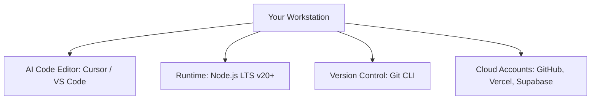

# 0.1 The Vibecoding Stack Setup

<div class="session-banner">
  <div class="banner-header">
    <svg xmlns="http://www.w3.org/2000/svg" width="18" height="18" viewBox="0 0 24 24" fill="none" stroke="currentColor" stroke-width="2" stroke-linecap="round" stroke-linejoin="round"><circle cx="12" cy="12" r="10"></circle><polygon points="10 8 16 12 10 16 10 8"></polygon></svg>
    <strong class="banner-title">Prerequisites: Environment Preparation Before Day 1</strong>
  </div>
  Before Day 1 begins, every participant must have their workstation fully configured. Getting compilers, runtimes, editors, and version control ready in advance ensures we spend 100% of workshop time building and steering rather than debugging local installations.
</div>

## The Core Development Stack

The vibecoding workflow combines modern AI agent capabilities with standard software engineering runtimes. Here is the minimum viable stack required on your laptop:



---

## 1. Code Editor: Cursor (Recommended) or VS Code

Vibecoding requires an editor capable of workspace indexing, agentic search, and multi-file surgical diffs.

=== "Option A: Cursor (Strongly Recommended)"
    **Cursor** is an AI-native fork of VS Code with integrated workspace indexing, composer agents, and native `@-mention` context steering.
    
    1. Download Cursor from [cursor.com](https://www.cursor.com/).
    2. Install the application for your operating system (macOS, Windows, or Linux).
    3. Launch Cursor. You can import your existing VS Code keybindings, extensions, and themes with one click.
    4. Verify that the Command Palette works: Press `Ctrl+Shift+P` (Windows/Linux) or `Cmd+Shift+P` (macOS).

=== "Option B: VS Code with AI Extensions"
    If you prefer to stay in standard **Visual Studio Code**:
    
    1. Download and install VS Code from [code.visualstudio.com](https://code.visualstudio.com/).
    2. Open the Extensions Marketplace (`Ctrl+Shift+X` or `Cmd+Shift+X`).
    3. Install an agentic coding extension such as:
        - **Google Antigravity**: Agentic IDE integration for Google ecosystem and Gemini frontier models.
        - **Cline** or **Continue.dev**: Open-source extensions supporting API keys from Google AI Studio, Anthropic, or OpenAI.
    4. Ensure the extension is granted workspace read/write permissions.

---

## 2. JavaScript Runtime: Node.js LTS (v20+)

Node.js provides the local JavaScript runtime and package manager (`npm` / `npx`) required to scaffold web apps, run local dev servers, and execute modern frameworks like Vite or Next.js.

### Step 1: Download & Install
Download the **LTS (Long Term Support)** installer from [nodejs.org](https://nodejs.org/):
- **Windows**: Download the `.msi` installer and follow the wizard. Ensure "Add to PATH" is checked.
- **macOS**: Download the `.pkg` installer or install via Homebrew:
  ```bash
  brew install node@20
  ```
- **Linux (Ubuntu/Debian)**:
  ```bash
  curl -fsSL https://deb.nodesource.com/setup_20.x | sudo -E bash -
  sudo apt-get install -y nodejs
  ```

### Step 2: Verify Installation
Open a fresh terminal window (PowerShell, Bash, or Zsh) and run:

```bash
node -v
# Expected: v20.x.x or higher

npm -v
# Expected: 10.x.x or higher

npx -v
# Expected: 10.x.x or higher
```

> [!TIP]
> If `node -v` returns `'node' is not recognized` on Windows, restart your terminal or computer so the updated system `PATH` environment variable takes effect.

---

## 3. Version Control: Git CLI

Git is the fundamental safety net for AI-assisted engineering. When an AI generates an unhelpful change or introduces a regression, Git allows you to revert instantly with `git checkout .` or `git restore`.

### Step 1: Install Git
- **Windows**: Download and install [Git for Windows](https://git-scm.com/download/win). Select default options and ensure Git is added to the system PATH.
- **macOS**: Run `xcode-select --install` in Terminal, or install via Homebrew (`brew install git`).
- **Linux**: Run `sudo apt update && sudo apt install git -y`.

### Step 2: Configure Global Identity
Set up your name and email so your commits are attributed properly on GitHub:

```bash
git config --global user.name "Your Full Name"
git config --global user.email "your.email@example.com"
```

### Step 3: Verify Installation
```bash
git --version
# Expected: git version 2.40+ or similar
```

---

## 4. Verification Health Check

Run this single-line verification script in your terminal to confirm that your workstation is 100% prepared:

=== "macOS & Linux (Bash/Zsh)"
    ```bash
    echo "=== Stack Verification ===" && \
    git --version && \
    node -v && \
    npm -v && \
    echo "Environment verified successfully!"
    ```

=== "Windows (PowerShell)"
    ```powershell
    Write-Host "=== Stack Verification ==="
    git --version
    node -v
    npm -v
    Write-Host "Environment verified successfully!" -ForegroundColor Green
    ```

Once all three commands output version numbers without errors, you are ready to proceed to [0.2 Account Provisioning](02-account-provisioning.md).
