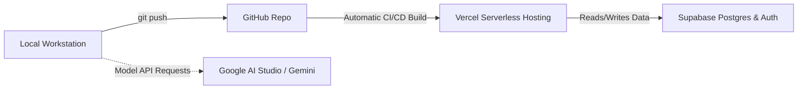

# 0.2 Account Provisioning: Free Cloud Tiers

  

    <svg xmlns="http://www.w3.org/2000/svg" width="18" height="18" viewBox="0 0 24 24" fill="none" stroke="currentColor" stroke-width="2" stroke-linecap="round" stroke-linejoin="round"><circle cx="12" cy="12" r="10"></circle><polygon points="10 8 16 12 10 16 10 8"></polygon></svg>
    <strong class="banner-title">Prerequisites: Cloud Developer Infrastructure</strong>
  

  Vibecoding 101 uses a 100% free-tier stack. You will provision four cloud accounts that work in harmony: GitHub stores your code, Vercel hosts your web app on a public HTTPS URL, Supabase provides a hosted Postgres database, and Google AI Studio grants free API access to frontier models.

## The Zero-Cost Cloud Ecosystem

---

## 1. GitHub Account (Source Control & Identity)

GitHub is the standard identity provider for developers. Your Vercel and Supabase accounts will log in directly using your GitHub credentials.

1. Navigate to [github.com](https://github.com/) and click **Sign up**.
2. Complete the registration using your university or personal email.
3. Enable Two-Factor Authentication (2FA) in **Settings &rarr; Password and authentication**.
4. *(Optional but recommended)* Configure an SSH key or create a Personal Access Token (Classic) for smooth command-line pushing:
   - Go to **Settings &rarr; Developer Settings &rarr; Personal access tokens**.
   - Generate a new token with `repo` scope.

---

## 2. Vercel Account (Instant Cloud Deployment)

Vercel provides instant worldwide deployment of frontend and fullstack web apps directly from your GitHub repository.

1. Navigate to [vercel.com/signup](https://vercel.com/signup).
2. Choose **Continue with GitHub**.
3. Authorize Vercel to access your GitHub repositories.
4. Select the **Hobby Plan** (100% free for non-commercial student use).
5. Once your dashboard loads, you are ready to ship live deployments with automated HTTPS SSL certificates and edge network routing.

---

## 3. Supabase Account (Managed Postgres & RLS)

Supabase is an open-source Firebase alternative providing a production-grade PostgreSQL database, instant REST/GraphQL APIs, and built-in user authentication.

1. Navigate to [supabase.com](https://supabase.com/).
2. Click **Start your project** and sign in with **GitHub**.
3. Authorize Supabase to connect with your GitHub account.
4. Supabase's Free Tier includes:
   - 2 active database projects.
   - 500 MB database space.
   - 50,000 monthly active users (Auth).
   - Built-in Row Level Security (RLS) policies.
5. In Day 3, we will create our database tables and configure Row Level Security directly in this dashboard.

---

## 4. Google AI Studio Account (Gemini Frontier Models)

Google AI Studio provides direct access to Google's most powerful reasoning and multimodal models with an unprecedented free tier.

1. Navigate to [aistudio.google.com](https://aistudio.google.com/).
2. Sign in with your standard Google Account.
3. Agree to the Terms of Service.
4. Under the free tier, **Gemini 2.0 Flash** gives you:
   - **1,048,576 tokens** context window (enough to read full codebases in a single prompt).
   - **15 Requests Per Minute (RPM)** completely free.
   - **1,500 Requests Per Day (RPD)** completely free.
   - Direct support for text, code, audio, and multimodal vision inputs.

---

## Account Readiness Checklist

Before proceeding to generate your API keys, confirm the following:

| Service | Purpose | Free Tier Limit | Account Status |
| :--- | :--- | :--- | :--- |
| **GitHub** | Code repo, commit history, identity provider | Unlimited public/private repos | [x] Ready |
| **Vercel** | Automated CI/CD deployment, live HTTPS URL | Unlimited Hobby deployments | [x] Ready |
| **Supabase** | Cloud PostgreSQL database & Row Level Security | 2 free projects, 500MB DB | [x] Ready |
| **Google AI Studio**| Gemini 2.0 Flash API access (1M tokens) | 15 RPM / 1,500 RPD free | [x] Ready |

Now proceed to [0.3 API Keys 101 & Secret Safety](03-api-keys-101.md) to generate your credentials and learn why credentials must never be committed to Git.
