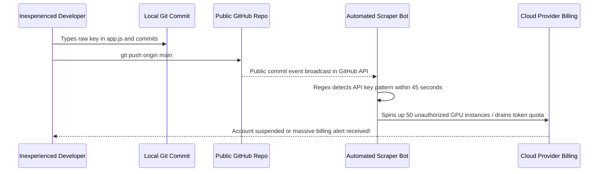

# 0.3 API Keys 101: Generation & Leak Prevention

<div class="session-banner">
  <div class="banner-header">
    <svg xmlns="http://www.w3.org/2000/svg" width="18" height="18" viewBox="0 0 24 24" fill="none" stroke="currentColor" stroke-width="2" stroke-linecap="round" stroke-linejoin="round"><circle cx="12" cy="12" r="10"></circle><path d="M12 8v4"></path><path d="M12 16h.01"></path></svg>
    <strong class="banner-title">Critical Security Principle: Never Push Secrets to Git</strong>
  </div>
  An API key is the digital equivalent of your personal signature and credit card for cloud computing. In this module, you will generate your keys, learn how automated scraping bots target GitHub repositories, and master the standard local isolation patterns.
</div>

## What is an API Key?

An **API Key** is a long alphanumeric token passed inside HTTP request headers to authenticate your application with remote AI servers:

```http
POST /v1beta/models/gemini-2.0-flash:generateContent HTTP/1.1
Host: generativelanguage.googleapis.com
Content-Type: application/json
x-goog-api-key: AIzaSyB8xQZ12345RealKeyExample
```

When the server receives this key, it matches the string against your cloud account, checks your rate limits, and processes your tokens.

---

## 1. How to Generate Your Free Google AI Studio Key

For this workshop, our primary engine is **Gemini 2.0 Flash** via Google AI Studio:

1. Open [aistudio.google.com/apikey](https://aistudio.google.com/apikey).
2. Click **Create API Key**.
3. Choose **Create API key in new project** (or select an existing Google Cloud project).
4. A 39-character key beginning with `AIzaSy...` will be generated.
5. Copy the key and save it temporarily in a secure password manager or local scratch file that is outside your Git repositories.

---

## 2. Generating Keys on Other Frontier Providers

If you choose to experiment with OpenAI or Anthropic in your own projects:

=== "OpenAI (GPT-4o, o3-mini)"
    1. Navigate to [platform.openai.com/api-keys](https://platform.openai.com/api-keys).
    2. Click **Create new secret key**.
    3. Name your key (e.g., `vibecoding-dev`) and copy the token starting with `sk-...`.
    4. *Note*: OpenAI requires a pre-funded billing balance ($5 minimum) to execute API calls.

=== "Anthropic (Claude 3.5 Sonnet / Haiku)"
    1. Navigate to [console.anthropic.com/settings/keys](https://console.anthropic.com/settings/keys).
    2. Click **Create Key**.
    3. Copy the token starting with `sk-ant-...`.
    4. *Note*: Anthropic requires pre-paid credits to execute API requests outside the web chat.

---

## 3. The Threat: The 60-Second GitHub Scraper Bot

Why do instructors repeatedly emphasize: **"NEVER commit an API key to a public repository"**?



### Why `git commit` then deleting it is NOT enough!
A widespread beginner mistake is:
1. Student accidentally pushes an API key in `app.js`.
2. Student realizes the mistake, deletes the key from `app.js`, and pushes a second commit.
3. **The key is still 100% exposed!** Git is an immutable ledger. Any user or scraper bot can browse the commit history (`git log` or the GitHub commit diff) and read the key from the previous commit.
4. If you ever commit a key publicly, you must **immediately revoke and delete the key** in your cloud dashboard.

---

## 4. The Golden Defense: `.gitignore` and `.env.local`

To prevent accidental leaks, professional developers separate code from configuration:

### Rule 1: Always use a `.gitignore`
In the root directory of every project, verify that `.gitignore` contains:

```gitignore
# Environment secrets (Never commit!)
.env
.env.local
*.env
.env.*.local

# Build artifacts and dependencies
node_modules/
dist/
.DS_Store
```

### Rule 2: Keep secrets in `.env.local`
Place your real secret key in a local-only file named `.env.local`:

```ini
# .env.local - Ignored by Git
GEMINI_API_KEY=AIzaSyB8xQZ12345RealKeyExample
SUPABASE_URL=https://xyzcompany.supabase.co
SUPABASE_ANON_KEY=eyJhbGciOi...
```

### Rule 3: Provide a `.env.example` template for collaborators
Commit a clean template file named `.env.example` that indicates which keys are required without revealing actual values:

```ini
# .env.example - Safe to commit to GitHub
GEMINI_API_KEY=your_gemini_api_key_here
SUPABASE_URL=your_supabase_project_url
SUPABASE_ANON_KEY=your_supabase_anon_key
```

---

## 5. Instant Key Verification Test

Before Day 1 begins, run this quick cURL sanity check in your terminal (replace `YOUR_API_KEY` with your actual Google AI Studio key):

```bash
curl "https://generativelanguage.googleapis.com/v1beta/models/gemini-2.0-flash:generateContent?key=YOUR_API_KEY" \
  -H "Content-Type: application/json" \
  -d '{"contents":[{"parts":[{"text":"Say hello in 5 words."}]}]}'
```

If you receive a JSON response containing generated text, your key is active and your environment is primed for Day 1.
